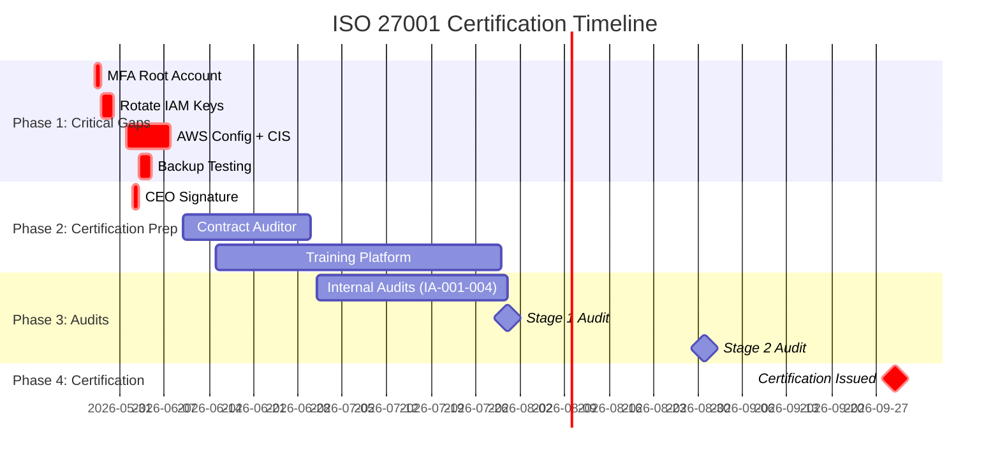

# 🔐 TWYN ISO 27001:2022 Certification Project

**Sistema de Gestão de Segurança da Informação (SGSI)**  
Face ID Platform API + AWS Infrastructure

[📋 Project Board](https://github.com/bekaa-trusted-advisors/TWYN-ISO27001/projects) • [🐛 Issues](https://github.com/bekaa-trusted-advisors/TWYN-ISO27001/issues) • [📊 Linear](https://linear.app/bekaa/project/aegis-compliance-1218ffb6780f)

---
### 🌐 [Acessar o Compliance Dashboard (Portal do Auditor)](https://twyn-iso-dashboard.vercel.app/)
*O repositório do GitHub atua como a Fonte da Verdade (Compliance-as-Code). A visualização interativa do SoA, Políticas e Evidências para fins de auditoria deve ser feita exclusivamente através do Dashboard acima.*

---

## 🎯 Quick Stats

| Metric | Status | Target |
|--------|--------|--------|
| **Mandatory Documents** | ✅ 14/14 (100%) | Complete |
| **Annex A Controls** | 🟡 70% implemented | 85% by Q3 |
| **Risks Identified** | ✅ 18 documented | All mitigated |
| **CARs Open** | 🔴 4 critical | 0 by June |
| **Policies** | ✅ 7 approved | 7 |
| **SOPs** | ✅ 5 documented | 5 |
| **Training** | 🔴 0% complete | 100% by July |
| **Certification Readiness** | 🟡 85% | 100% by Aug |

---

## 📚 Documentation Index

### 🎓 Getting Started
- **New to ISO 27001?** Start with [GLOSSARY.md](GLOSSARY.md) (100+ terms explained)
- **Project Status** → [STATUS-REPORT-2026-05-26.md](STATUS-REPORT-2026-05-26.md)
- **Integration Guide** → [LINEAR-INTEGRATION-PLAN.md](LINEAR-INTEGRATION-PLAN.md)

### 📖 Core Documents (14 Mandatory)

<b>Clauses 4-10 (ISO 27001 Requirements)</b>

| Doc ID | Document | Location | Status |
|--------|----------|----------|--------|
| SGSI-SCOPE-001 | ISMS Scope Definition | [docs/01-mandatory-clauses/](docs/01-mandatory-clauses/clause-4-context-isms-scope.md) | ✅ |
| SGSI-OBJ-001 | Information Security Objectives | [docs/01-mandatory-clauses/](docs/01-mandatory-clauses/information-security-objectives.md) | ✅ |
| SGSI-RACI-001 | RACI Matrix | [docs/01-mandatory-clauses/](docs/01-mandatory-clauses/raci-matrix.md) | ✅ |
| SGSI-POLICY-001 | Information Security Policy | [docs/02-policies/](docs/02-policies/information-security-policy.md) | ⚠️ Awaiting CEO signature |
| SGSI-RISK-001 | Risk Assessment Methodology | [docs/04-risk-management/](docs/04-risk-management/risk-assessment-methodology.md) | ✅ |
| SGSI-RISK-002 | Risk Register (18 risks) | [docs/04-risk-management/](docs/04-risk-management/risk-register.md) | ✅ |
| SGSI-RTP-001 | Risk Treatment Plan | [docs/04-risk-management/](docs/04-risk-management/risk-treatment-plan.md) | ✅ |
| SGSI-SOA-001 | Statement of Applicability (93 controls) | [docs/04-risk-management/](docs/04-risk-management/statement-of-applicability.md) | ✅ |
| SGSI-ASSETS-001 | Asset Inventory (49 assets) | [docs/05-evidence/](docs/05-evidence/asset-inventory.md) | ✅ |
| SGSI-COMP-001 | Competence Records | [docs/05-evidence/](docs/05-evidence/competence-records.md) | ✅ |
| SGSI-AUDIT-001 | Internal Audit Programme | [docs/05-evidence/](docs/05-evidence/internal-audit-programme.md) | ✅ |
| SGSI-MREVIEW-001 | Management Review Template | [docs/05-evidence/](docs/05-evidence/management-review-template.md) | ✅ |
| SGSI-NCR-001 | Nonconformity Register (4 NCRs) | [docs/05-evidence/](docs/05-evidence/nonconformity-register.md) | ✅ |
| SGSI-CAR-001 | Corrective Action Log (4 CARs) | [docs/05-evidence/](docs/05-evidence/corrective-action-log.md) | ✅ |

### 🛡️ Operational Policies (7)

| Policy ID | Title | Controls | Status |
|-----------|-------|----------|--------|
| SGSI-POLICY-001 | [Information Security Policy](docs/02-policies/information-security-policy.md) | A.5.1 | ⚠️ CEO signature pending |
| SGSI-POLICY-002 | [Access Control Policy](docs/02-policies/access-control-policy.md) | A.5.15-5.18 | ✅ |
| SGSI-POLICY-003 | [Incident Response Policy](docs/02-policies/incident-response-policy.md) | A.5.24-5.28 | ✅ |
| SGSI-POLICY-004 | [Asset Management Policy](docs/02-policies/asset-management-policy.md) | A.5.9-5.12 | ✅ |
| SGSI-POLICY-005 | [Backup & Recovery Policy](docs/02-policies/backup-recovery-policy.md) | A.5.29-30, A.8.13-14 | ✅ |
| SGSI-POLICY-006 | [Business Continuity Plan](docs/02-policies/business-continuity-plan.md) | A.5.29-30 | ✅ |
| SGSI-POLICY-007 | [Acceptable Use Policy](docs/02-policies/acceptable-use-policy.md) | A.5.10, A.6.2 | ✅ |

### ⚙️ Standard Operating Procedures (5)

| SOP ID | Procedure | Details |
|--------|-----------|---------|
| SOP-001 | [Onboarding/Offboarding](docs/03-procedures/sop-001-onboarding-offboarding.md) | Provisioning, de-provisioning, training Day 1 |
| SOP-002 | [Change Management](docs/03-procedures/sop-002-change-management.md) | Change classification, approval workflows |
| SOP-003 | [Remote Work Security](docs/03-procedures/sop-003-remote-work.md) | VPN, endpoint security, BYOD |
| SOP-004 | [Secrets Management](docs/03-procedures/sop-004-secrets-management.md) | Rotation schedules, AWS Secrets Manager |
| SOP-005 | [IAM Recertification](docs/03-procedures/sop-005-iam-recertification.md) | Quarterly access reviews |

### 🔧 Implementation Guides (8)

Step-by-step technical guides for resolving gaps:

| Guide | Gap | Priority | ETA |
|-------|-----|----------|-----|
| [GAP-001](docs/06-implementation-guides/gap-001-mfa-root-account.md) | Enable MFA on AWS root account | 🔴 Critical | 1h |
| [GAP-002](docs/06-implementation-guides/gap-002-rotate-iam-key.md) | Rotate IAM key >90 days | 🔴 High | 2h |
| [GAP-003](docs/06-implementation-guides/gap-003-aws-config-cis.md) | AWS Config + CIS Benchmarks | 🔴 Critical | 12h |
| [GAP-004](docs/06-implementation-guides/gap-004-backup-testing.md) | Test backup restoration | 🔴 High | 6h |
| [GAP-005](docs/06-implementation-guides/gap-005-aws-support-decision.md) | AWS Support level decision | 🟡 Medium | 2h |
| [GAP-006](docs/06-implementation-guides/gap-006-ceo-signature.md) | CEO signature on IS Policy | 🔴 Blocker | 1h |
| [GAP-007](docs/06-implementation-guides/gap-007-iso-certification.md) | ISO cert for Gestor SGSI | 🟡 Medium | 40h |
| [GAP-008](docs/06-implementation-guides/gap-008-hire-devops.md) | Hire Junior DevOps (SPOF) | 🟡 Medium | 3 months |

### 🔍 Audit Templates (3)

| Template | Purpose |
|----------|---------|
| [Internal Audit Checklist](docs/07-audit-templates/internal-audit-checklist.md) | 93 Annex A controls checklist |
| [Audit Report Template](docs/07-audit-templates/audit-report-template.md) | Standard format for audit reports |
| [Evidence Collection Guide](docs/07-audit-templates/evidence-collection-guide.md) | How to collect & organize evidence |

---

## 🚨 Critical Blockers (Must Resolve)

| # | Blocker | Owner | Due Date | Status |
|---|---------|-------|----------|--------|
| [#6](https://github.com/bekaa-trusted-advisors/TWYN-ISO27001/issues/6) | 🔴 CEO Signature on IS Policy | Gestor SGSI | 2026-06-02 | 🔴 Open |
| [#1](https://github.com/bekaa-trusted-advisors/TWYN-ISO27001/issues/1) | 🔴 Enable MFA on root account | DevOps Lead | 2026-06-01 | 🔴 Open |
| [#3](https://github.com/bekaa-trusted-advisors/TWYN-ISO27001/issues/3) | 🔴 AWS Config + CIS | DevOps Lead | 2026-06-08 | 🔴 Open |
| [#4](https://github.com/bekaa-trusted-advisors/TWYN-ISO27001/issues/4) | 🔴 Backup testing (AWS FTR) | DevOps Lead | 2026-06-05 | 🔴 Open |

👉 **See all 15 issues**: [GitHub Issues](https://github.com/bekaa-trusted-advisors/TWYN-ISO27001/issues)

---

## 📅 Roadmap to Certification

---

## 👥 Team & Responsibilities

| Role | Name | Responsibilities |
|------|------|------------------|
| **Gestor SGSI** | Ricardo Esper (resper@bekaa.eu) | ISMS owner, compliance, audits |
| **DevOps Lead** | [Name] | Technical implementation, AWS, CARs |
| **CEO** | [Name] | Policy approval, budget, strategic decisions |
| **Consultant** | Bekaa Trusted Advisors | ISO 27001 expertise, documentation |

**RACI Matrix**: See [SGSI-RACI-001](docs/01-mandatory-clauses/raci-matrix.md)

---

## 🎓 Training Program

**Mandatory for all employees**:
- 📚 ISO 27001 Awareness (1h)
- 🔒 LGPD Data Protection (1h)
- 🎣 Phishing Awareness (30min)
- 🔑 Password Security + MFA (30min)

**Role-specific**:
- 💻 Developers: OWASP Top 10 (2h), Secure Coding (2h)
- ⚙️ DevOps: AWS Security (2h), CIS Benchmarks (1h)
- 👔 Management: ISO 27001 Lead Implementer (40h)

👉 **Full details**: [TRAINING-PROGRAM.md](TRAINING-PROGRAM.md)

---

## 💰 Budget Summary

| Category | Cost (€) | Status |
|----------|----------|--------|
| **Certification Auditor** | 15,000-20,000 | Pending approval |
| **Training Platform** | 500/year | Pending |
| **ISO Cert (Gestor SGSI)** | 2,500 | Pending |
| **AWS Config/Security Hub** | 720/year | Approved |
| **Junior DevOps Hire** | 45,000/year | Planned Q3 |
| **AWS Business Support** | 1,500/year | Decision pending |
| **TOTAL Year 1** | **€65,000-75,000** | |

---

## 🔗 Quick Links

- 🎯 **GitHub Issues**: [View all 15 issues](https://github.com/bekaa-trusted-advisors/TWYN-ISO27001/issues)
- 📊 **Linear Project**: [Aegis Compliance](https://linear.app/bekaa/project/aegis-compliance-1218ffb6780f)
- 📚 **ISO 27001 Standard**: [iso.org/standard/27001](https://www.iso.org/standard/27001)
- 🔍 **AWS FTR**: [AWS Foundational Technical Review](https://aws.amazon.com/marketplace/partners/ftr)
- 📖 **LGPD**: [Lei Geral de Proteção de Dados](https://www.gov.br/cidadania/pt-br/acesso-a-informacao/lgpd)

---

## 🤝 Contributing

This is an internal project for TWYN ISO 27001 certification. Contributions are limited to:
- ✅ TWYN employees
- ✅ Bekaa consultants
- ✅ Authorized auditors

For questions: **Ricardo Esper** (resper@bekaa.eu)

---

## 📜 License

**Confidential** - Internal use only. Not for public distribution.

---

**Last Updated**: 2026-06-11  
**Version**: 1.1  
**Compliance Status**: 🟡 85% Ready

Made with 🔐 by [Bekaa Trusted Advisors](https://bekaa.eu)

