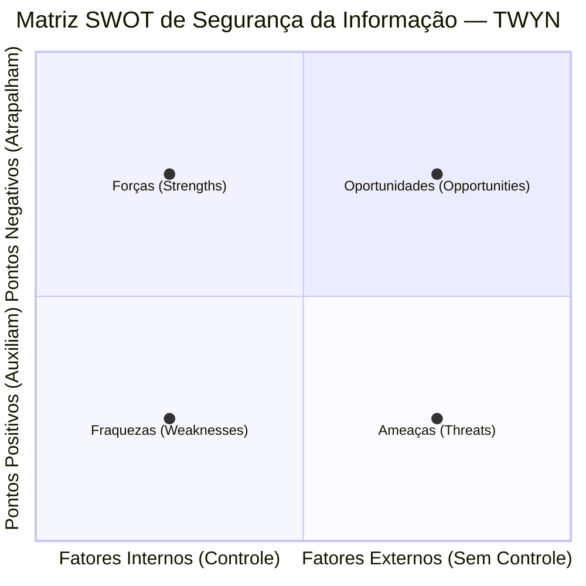

# Análise de Contexto Organizacional (Cláusula 4.1)

## 1. Objetivo
Este documento formaliza a determinação das **questões internas e externas** que são relevantes para o propósito da TWYN e que afetam sua capacidade de alcançar os resultados pretendidos de seu Sistema de Gestão de Segurança da Informação (SGSI), conforme exigido pela **Cláusula 4.1 da ABNT NBR ISO/IEC 27001:2022**.

## 2. Metodologia
A análise de contexto da TWYN baseia-se em dois frameworks consolidados de gestão de risco estratégico:
1.  **PESTEL (Político, Econômico, Social, Tecnológico, Ecológico/Ambiental, Legal)**: Utilizado para mapear as forças e questões externas que afetam o ambiente em que a TWYN opera.
2.  **SWOT (Forças, Fraquezas, Oportunidades, Ameaças)**: Utilizado para consolidar o posicionamento estratégico interno de segurança em relação ao contexto externo.

A análise de contexto é revisada pelo menos uma vez ao ano, ou diante de mudanças significativas na arquitetura técnica, no modelo de negócio ou no cenário regulatório aplicável.

---

## 3. Análise do Contexto Externo (PESTEL)

### 3.1 Político (Political)
-   **Pressão por soberania de dados**: Governos nacionais exercem maior controle regulatório sobre infraestruturas digitais e dados biométricos.
-   **Conflitos geopolíticos e cibernéticos**: Aumento de ataques cibernéticos patrocinados por estados de forma geral, exigindo maior resiliência de infraestruturas baseadas em cloud pública (AWS).

### 3.2 Econômico (Economic)
-   **Modelo B2B SaaS**: A segurança da informação é o maior argumento de vendas para clientes B2B (bancos, fintechs e grandes empresas). A falta de conformidade inviabiliza novos contratos.
-   **Custo de mitigação**: Orçamento limitado como startup para contratação de equipes internas exclusivas de SecOps, justificando o modelo de consultoria externa (Bekaa).

### 3.3 Social (Social)
-   **Preocupação com Privacidade**: A percepção pública sobre o uso e vazamento de dados biométricos é extremamente sensível. Qualquer vazamento causa impacto reputacional fatal.
-   **Cultura de trabalho remoto**: A equipe operacional é majoritariamente híbrida/remota, aumentando a exposição a ameaças fora do perímetro de rede tradicional.

### 3.4 Tecnológico (Technological)
-   **Plataformas Cloud-Native (AWS)**: A dependência total de serviços como EKS, RDS, S3 e KMS delega a segurança física à AWS, mas exige configuração de segurança avançada na camada do cliente.
-   **Inteligência Artificial e Deepfakes**: Vetores de ataques sofisticados de injeção de imagens e bypass biométrico (Liveness Detection é um controle chave).

### 3.5 Ambiental (Environmental)
-   **Pegada de carbono**: Embora a TWYN opere 100% em nuvem e a pegada direta seja baixa, as auditorias corporativas de clientes começam a demandar declarações de ESG dos datacenters AWS utilizados.

### 3.6 Legal / Regulatório (Legal)
-   **Lei Geral de Proteção de Dados (LGPD - Lei 13.709/2018)**: O processamento de imagens faciais é classificado como **dado pessoal sensível (Art. 11)**. Multas graves (Art. 52) e obrigatoriedade de relatórios de impacto (RIPD/DPIA).
-   **Normativas do Banco Central (BACEN)**: Requisitos estritos para fornecedores de tecnologia que atendem instituições financeiras (ex: Resolução CMN 4.893).

---

## 4. Análise do Contexto Interno (SWOT)

### 4.1 Forças (Pontos Fortes Internos)
1.  **Tecnologia Cloud-Native Segura**: Arquitetura automatizada via Terraform no AWS (Multi-AZ) e EKS. Criptografia forte de dados em trânsito e em repouso com chaves gerenciadas (KMS CMK).
2.  **SOPs Operacionais Definidos**: Procedimentos para controle de acesso, onboarding, gerenciamento de segredos e recertificação já padronizados.
3.  **Engajamento de Assessoria Especializada**: Ricardo Esper (Bekaa Trusted Advisors) formally nomeado como Gestor SGSI.

### 4.2 Fraquezas (Pontos Fracos Internos)
1.  **Recursos Humanos Limitados (SPOF)**: Dependência extrema de uma única pessoa para operações de infraestrutura e segurança (DevOps Lead).
2.  **Processo de Treinamento Pendente**: Falta de evidência de treinamento formal de conscientização em segurança entregue à equipe.
3.  **Falta de Assinatura Formal**: Documentos do SGSI concluídos, mas ainda sem aprovação e assinatura oficial da diretoria (CEO).

### 4.3 Oportunidades (Fatores Positivos Externos)
1.  **Diferenciação no Mercado**: A certificação ISO 27001 posicionará a TWYN como uma das plataformas de biometria mais confiáveis do mercado B2B, destravando contratos de alto valor.
2.  **Auditoria FTR da AWS**: A homologação no AWS Foundational Technical Review (FTR) gera selo oficial e créditos na AWS.

### 4.4 Ameaças (Fatores Negativos Externos)
1.  **Evolução de Técnicas de Ataque**: Ataques direcionados à plataforma de biometria ou sequestro de dados (Ransomware) via credenciais expostas.
2.  **Rigidez Fiscalizatória da ANPD**: Multas elevadas e sanções administrativas caso ocorra incidente de dados de biometria.

---

## 5. Matriz de Questões Internas e Externas

Esta tabela detalha como cada questão de contexto mapeia-se para o SGSI, as consequências associadas e os respectivos tratamentos de risco.

| ID | Questão de Contexto | Tipo | Consequência no SGSI | Relação com Risco (Risk Register) | Tratamento / Controle Aplicável |
|----|---------------------|------|-----------------------|----------------------------------|--------------------------------|
| **Q-01** | Regulamentação de dados biométricos (LGPD Art. 11) | Externa | Responsabilidade civil/penal e penalizações administrativas da ANPD em caso de incidentes. | RISK-002, RISK-011 | DPO nomeado, RIPD aprovado, controle A.8.11 (Máscara) e A.8.24 (Crypto). |
| **Q-02** | Dependência de um único DevOps Lead (SPOF) | Interna | Atrasos na mitigação de falhas críticas de infraestrutura e comprometimento da continuidade de negócio. | RISK-007, RISK-015 | BCP atualizado, contratação de Júnior DevOps (GAP-008), treinamento cruzado. |
| **Q-03** | Necessidade de selo FTR AWS e auditorias B2B | Externa | Bloqueio de vendas e perda de mercado estratégico para concorrentes certificados. | RISK-018 | Certificação ISO 27001 (CERT-001) e implementação dos CARs AWS. |
| **Q-04** | Vulnerabilidade de credenciais expostas e chaves antigas | Interna | Vazamento de chaves de infraestrutura e escalada de privilégios. | RISK-009, RISK-010 | Implementação do SOP-004 e SOP-005; Rotação de chaves a cada 90 dias. |
| **Q-05** | Vazamento ou perda de imagens biométricas em S3 | Interna | Perda permanente de dados de clientes e sanções de privacidade. | RISK-006, RISK-014 | Ativação do S3 CRR (us-west-2), MFA Delete, e auditoria automatizada AWS Config. |
| **Q-06** | Cultura de home office / acesso remoto pela equipe | Externa | Risco de espionagem física ou comprometimento de credenciais em redes WiFi inseguras. | RISK-012 | Implementação do SOP-003 (Trabalho Remoto) e Política de Uso Aceitável (AUP). |

---

## 6. Aprovação

Este documento é a base para o escopo e o registro de riscos do SGSI, tendo sido homologado e aprovado.

| Papel | Nome | Assinatura | Data |
|-------|------|------------|------|
| **CEO TWYN** | Enes Fernando Degasperi | ________________________ | ___/___/2026 |
| **Gestor SGSI** | Ricardo Esper | ________________________ | ___/___/2026 |
