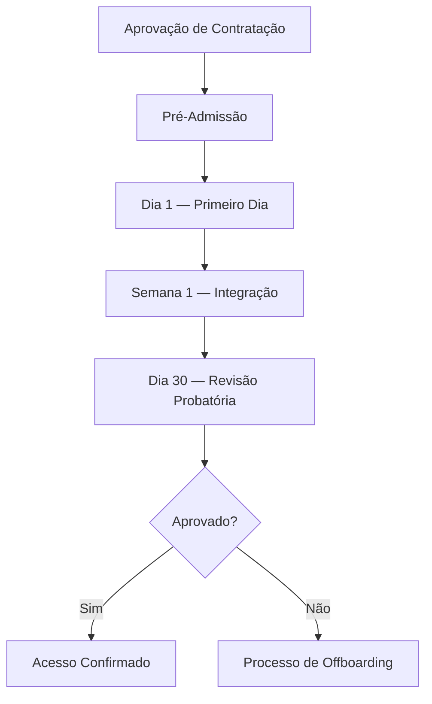
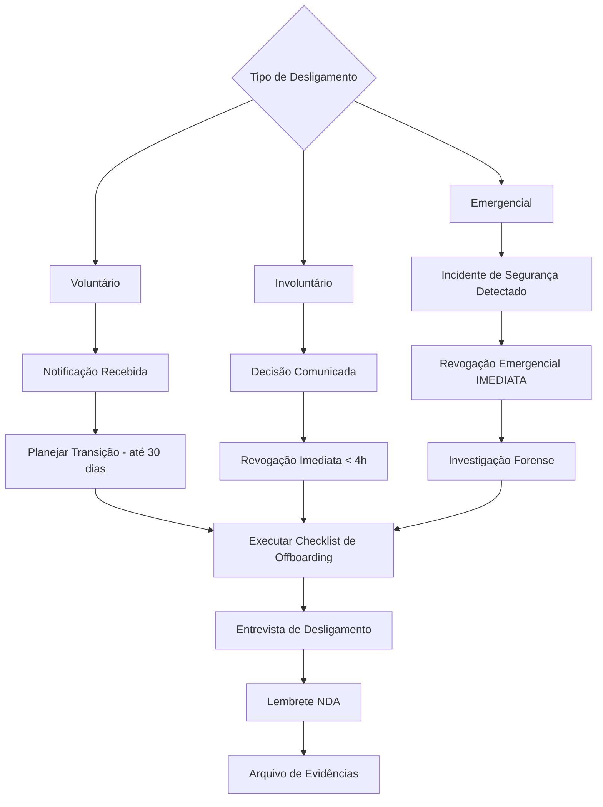

# SOP-001: Onboarding e Offboarding de Colaboradores

> **Classificação:** INTERNO  
> **Versão:** 1.0 — Draft  
> **Proprietário:** Gestor SGSI  
> **Aprovação:** CEO (Pendente)

---

## 1. Objetivo

Este Procedimento Operacional Padrão (POP) estabelece as etapas obrigatórias para o provisionamento (**onboarding**) e desprovisionamento (**offboarding**) de acessos, equipamentos e treinamentos de segurança para todos os colaboradores, estagiários, prestadores de serviço e terceiros da **TWYN**.

O objetivo é garantir que:

- Todo acesso seja concedido conforme o princípio do **menor privilégio** (least privilege);
- Dados biométricos processados pela plataforma Face ID sejam protegidos conforme **LGPD Art. 11** (dados sensíveis);
- Acessos sejam revogados dentro do SLA de **< 4 horas** em desligamentos;
- Evidências auditáveis sejam geradas em cada etapa para fins de certificação ISO 27001:2022.

---

## 2. Escopo

| Item | Detalhamento |
|------|-------------|
| **Organização** | TWYN (~10 colaboradores) |
| **Plataforma** | Face ID Platform API |
| **Infraestrutura** | AWS (EKS, RDS, S3) — Conta `992382542028`, região `us-east-1` |
| **Repositórios** | GitHub (bekaa-trusted-advisors) |
| **CI/CD** | GitHub Actions |
| **IaC** | Terraform |
| **Dados sensíveis** | Dados biométricos faciais (LGPD Art. 11) |
| **Classificação de dados** | PUBLIC / INTERNAL / CONFIDENTIAL / RESTRICTED |

### 2.1 Aplicabilidade

Este procedimento aplica-se a:

- Colaboradores CLT (tempo integral e parcial);
- Estagiários;
- Prestadores de serviço / terceiros com acesso a sistemas TWYN;
- Consultores temporários.

---

## 3. Definições e Siglas

| Sigla / Termo | Definição |
|----------------|-----------|
| **SGSI** | Sistema de Gestão de Segurança da Informação |
| **NDA** | Non-Disclosure Agreement (Acordo de Confidencialidade) |
| **MFA** | Multi-Factor Authentication (Autenticação Multifator) |
| **IAM** | Identity and Access Management (AWS) |
| **RBAC** | Role-Based Access Control |
| **SLA** | Service Level Agreement |
| **EKS** | Elastic Kubernetes Service |
| **RDS** | Relational Database Service |
| **S3** | Simple Storage Service |
| **ECR** | Elastic Container Registry |
| **IaC** | Infrastructure as Code |

---

## 4. Papéis e Responsabilidades (Matriz RACI)

| Atividade | CEO | Gestor SGSI | DevOps Lead | RH / Administrativo | Gestor Direto |
|-----------|:---:|:-----------:|:-----------:|:-------------------:|:-------------:|
| Aprovação de contratação | **A** | I | I | **R** | C |
| Verificação de antecedentes (screening) | I | **A** | — | **R** | C |
| Assinatura de NDA | **A** | C | — | **R** | I |
| Assinatura de contrato de trabalho | **A** | I | — | **R** | I |
| Criação de conta AWS IAM | I | **A** | **R** | — | C |
| Criação de conta GitHub | I | **A** | **R** | — | C |
| Configuração de MFA | I | C | **R** | — | I |
| Provisionamento de e-mail corporativo | I | I | **R** | C | — |
| Entrega de equipamento | I | I | — | **R** | C |
| Treinamento de segurança (Day 1) | I | **R** | C | — | I |
| Reconhecimento da Política de SI | I | **A** | — | — | **R** |
| Revisão de acessos (Day 30) | I | **A** | **R** | — | C |
| Revogação de acessos (offboarding) | I | **A** | **R** | C | I |
| Coleta de equipamento | I | I | — | **R** | C |
| Entrevista de desligamento | I | C | — | **R** | I |
| Lembrete de NDA pós-desligamento | I | **R** | — | C | — |

> **Legenda:** **R** = Responsável | **A** = Aprovador | **C** = Consultado | **I** = Informado

---

## 5. Procedimento de Onboarding (Admissão)

### 5.1 Fluxo Geral de Onboarding



### 5.2 Fase 1 — Pré-Admissão (D-5 a D-1)

> **Responsável principal:** RH / Administrativo  
> **Controles ISO 27001:** A.6.1 (Screening), A.6.2 (Termos e Condições), A.6.6 (NDA)

| # | Ação | Responsável | Prazo | Evidência |
|---|------|-------------|-------|-----------|
| 1.1 | Receber aprovação formal de contratação do CEO | RH | D-5 | E-mail/documento de aprovação |
| 1.2 | Realizar verificação de antecedentes (background check) conforme A.6.1 | RH | D-5 a D-3 | Relatório de verificação arquivado |
| 1.3 | Preparar contrato de trabalho com cláusulas de segurança da informação | RH | D-3 | Contrato assinado |
| 1.4 | Preparar e coletar assinatura do **NDA** (Acordo de Confidencialidade) | RH / Gestor SGSI | D-3 | NDA assinado e arquivado |
| 1.5 | Definir perfil de acesso RBAC conforme a função | Gestor Direto / Gestor SGSI | D-3 | Formulário SGSI-FORM-001 preenchido |
| 1.6 | Solicitar equipamento (notebook, periféricos) ao setor administrativo | Gestor Direto | D-2 | Registro de solicitação |
| 1.7 | Configurar equipamento com hardening básico (criptografia de disco, antivírus, firewall) | DevOps Lead | D-1 | Checklist de hardening |
| 1.8 | Preencher o **Checklist de Pré-Admissão** (Seção 10.1) | RH | D-1 | Checklist assinado |

#### Perfis RBAC Disponíveis

| Perfil | Serviços AWS | GitHub | Observações |
|--------|-------------|--------|-------------|
| **CEO** | Read-Only (ViewOnlyAccess) | Org Owner (read) | Acesso somente leitura |
| **Gestor SGSI** | SecurityAudit | Security Manager | Auditoria e conformidade |
| **DevOps Lead** | AdministratorAccess | Org Admin | Acesso total — uso restrito |
| **Junior DevOps** | PowerUserAccess | Maintainer | Sem acesso a IAM/billing |
| **Developer** | EKS + ECR + CloudWatch (custom policy) | Write (repos específicos) | Acesso limitado |

### 5.3 Fase 2 — Dia 1 (Primeiro Dia de Trabalho)

> **Responsável principal:** DevOps Lead + Gestor SGSI  
> **Controles ISO 27001:** A.5.15 (Controle de Acesso), A.5.16 (Gestão de Identidade), A.5.17 (Autenticação)

| # | Ação | Responsável | Prazo | Evidência |
|---|------|-------------|-------|-----------|
| 2.1 | Entregar equipamento com Termo de Responsabilidade assinado | RH | Manhã D1 | Termo de responsabilidade |
| 2.2 | Criar usuário **AWS IAM** na conta `992382542028` conforme perfil RBAC aprovado | DevOps Lead | Manhã D1 | Screenshot/log do IAM console |
| 2.3 | Aplicar política IAM correspondente ao perfil RBAC | DevOps Lead | Manhã D1 | JSON da policy anexado |
| 2.4 | Configurar **MFA obrigatório** no AWS IAM (virtual MFA device ou hardware token) | DevOps Lead | Manhã D1 | Confirmação de MFA ativo |
| 2.5 | Definir senha temporária com requisitos: **≥ 14 caracteres**, complexidade, rotação a cada **90 dias** | DevOps Lead | Manhã D1 | Política de senha configurada |
| 2.6 | Convidar colaborador para a **organização GitHub** (`bekaa-trusted-advisors`) | DevOps Lead | Manhã D1 | Convite aceito no GitHub |
| 2.7 | Atribuir o colaborador ao(s) **time(s) GitHub** e repositórios conforme perfil | DevOps Lead | Manhã D1 | Captura dos times/repos |
| 2.8 | Configurar **MFA obrigatório** no GitHub (TOTP ou WebAuthn) | DevOps Lead | Manhã D1 | Confirmação de 2FA ativo |
| 2.9 | Criar **e-mail corporativo** (@twyn.com.br ou equivalente) | DevOps Lead / TI | Manhã D1 | Conta de e-mail ativa |
| 2.10 | Inscrever o colaborador no **Treinamento de Conscientização em Segurança** | Gestor SGSI | Tarde D1 | Registro de inscrição |
| 2.11 | Realizar sessão presencial/remota de orientação sobre segurança da informação: política de senhas, classificação de dados, tratamento de dados biométricos (LGPD Art. 11) | Gestor SGSI | Tarde D1 | Ata de reunião assinada |
| 2.12 | Preencher o **Checklist de Dia 1** (Seção 10.2) | DevOps Lead | Final D1 | Checklist assinado |

> ⚠️ **ATENÇÃO:** Nenhum acesso a sistemas que processam dados biométricos (RESTRICTED) será concedido antes da conclusão do treinamento de segurança e assinatura do NDA.

### 5.4 Fase 3 — Semana 1 (D+2 a D+5)

> **Responsável principal:** Gestor SGSI + Gestor Direto  
> **Controles ISO 27001:** A.6.2 (Termos e Condições), A.5.15 (Controle de Acesso)

| # | Ação | Responsável | Prazo | Evidência |
|---|------|-------------|-------|-----------|
| 3.1 | Concluir o **Treinamento de Conscientização em Segurança da Informação** (mínimo 2h) | Colaborador | D+3 | Certificado de conclusão |
| 3.2 | Obter **reconhecimento formal** da Política de Segurança da Informação (SGSI-POLICY-001) | Gestor Direto | D+3 | Termo de reconhecimento assinado |
| 3.3 | Obter **reconhecimento formal** da Política de Controle de Acesso (SGSI-POLICY-002) | Gestor Direto | D+3 | Termo de reconhecimento assinado |
| 3.4 | Verificar se todos os acessos provisionados estão funcionais e adequados ao perfil | DevOps Lead | D+5 | Relatório de verificação |
| 3.5 | Validar que o MFA está ativo em **todos** os serviços (AWS, GitHub, e-mail) | DevOps Lead | D+5 | Screenshots de validação |
| 3.6 | Confirmar que o colaborador **não** possui acessos além do necessário (least privilege) | Gestor SGSI | D+5 | Revisão documentada |
| 3.7 | Registrar a conclusão do onboarding no **Registro de Acessos** | Gestor SGSI | D+5 | Registro atualizado |

### 5.5 Fase 4 — Dia 30 (Revisão Probatória)

> **Responsável principal:** Gestor SGSI + Gestor Direto  
> **Controles ISO 27001:** A.5.18 (Direitos de Acesso)

| # | Ação | Responsável | Prazo | Evidência |
|---|------|-------------|-------|-----------|
| 4.1 | Realizar **recertificação de acessos**: validar se os acessos concedidos ainda são apropriados | Gestor SGSI | D+30 | Formulário de recertificação |
| 4.2 | Coletar feedback do gestor direto sobre desempenho e aderência às políticas | Gestor Direto | D+30 | Relatório de avaliação |
| 4.3 | Remover acessos provisórios ou temporários que não sejam mais necessários | DevOps Lead | D+30 | Log de alterações no IAM |
| 4.4 | Confirmar conclusão de todos os treinamentos obrigatórios | Gestor SGSI | D+30 | Registros de treinamento |
| 4.5 | Decidir pela **efetivação** ou **desligamento** do colaborador | CEO / Gestor Direto | D+30 | Documento de decisão |
| 4.6 | Se efetivado: registrar status final no inventário de acessos | Gestor SGSI | D+30 | Inventário atualizado |
| 4.7 | Se não efetivado: iniciar processo de **Offboarding** (Seção 6) | RH | D+30 | Início do offboarding |

---

## 6. Procedimento de Offboarding (Desligamento)

### 6.1 Fluxo Geral de Offboarding



### 6.2 Desligamento Voluntário (Pedido de Demissão)

> **SLA de Revogação:** Até o último dia de trabalho (máximo 30 dias de aviso prévio)  
> **Controles ISO 27001:** A.6.5 (Responsabilidades Pós-Desligamento), A.5.18 (Direitos de Acesso)

| # | Ação | Responsável | Prazo | Evidência |
|---|------|-------------|-------|-----------|
| 5.1 | Receber carta/e-mail formal de pedido de demissão | RH | D0 | Documento de demissão |
| 5.2 | Notificar o **Gestor SGSI** e **DevOps Lead** sobre o desligamento | RH | D0 | E-mail de notificação |
| 5.3 | Definir data de revogação de acessos (último dia útil) | Gestor SGSI | D0 | Registro da data |
| 5.4 | Iniciar plano de **transferência de conhecimento** (documentação, handover) | Gestor Direto | D0 a D-final | Plano de transição documentado |
| 5.5 | Revogar acesso gradual a sistemas RESTRICTED e CONFIDENTIAL conforme transição | DevOps Lead | Conforme plano | Logs de alteração |
| 5.6 | No **último dia**: executar o **Checklist Completo de Offboarding** (Seção 10.3) | DevOps Lead / RH | Último dia | Checklist preenchido |
| 5.7 | Realizar **entrevista de desligamento** | RH | Último dia | Ata da entrevista |
| 5.8 | Entregar **Lembrete Formal de NDA** (obrigações pós-contratuais) | Gestor SGSI | Último dia | Recibo assinado |
| 5.9 | Arquivar toda a documentação do offboarding | Gestor SGSI | D+1 | Pasta de evidências |

### 6.3 Desligamento Involuntário (Demissão pela Empresa)

> **SLA de Revogação:** **< 4 horas** após comunicação oficial  
> **Controles ISO 27001:** A.6.5, A.5.15, A.5.18

| # | Ação | Responsável | Prazo | Evidência |
|---|------|-------------|-------|-----------|
| 6.1 | CEO comunica decisão de desligamento ao RH | CEO | T0 | Documento de decisão |
| 6.2 | RH notifica **imediatamente** o Gestor SGSI e DevOps Lead | RH | T0 | E-mail/mensagem com timestamp |
| 6.3 | **Desabilitar usuário AWS IAM** (console + programático) | DevOps Lead | T0 + 1h | Log do IAM: `DisableUser` |
| 6.4 | **Revogar todas as access keys e session tokens** do IAM | DevOps Lead | T0 + 1h | Log do IAM: `DeleteAccessKey` |
| 6.5 | **Remover usuário da organização GitHub** | DevOps Lead | T0 + 1h | Log do GitHub audit |
| 6.6 | **Desativar MFA devices** e tokens de autenticação | DevOps Lead | T0 + 2h | Confirmação de desativação |
| 6.7 | **Revogar acesso ao e-mail corporativo** | DevOps Lead / TI | T0 + 2h | Conta suspensa |
| 6.8 | **Revogar acesso a VPN, ferramentas SaaS** e quaisquer outros serviços | DevOps Lead | T0 + 2h | Logs de revogação |
| 6.9 | Comunicar o desligamento ao colaborador | RH / Gestor Direto | T0 + 2h | Ata de comunicação |
| 6.10 | **Coletar equipamentos** (notebook, tokens, crachás) | RH | T0 + 4h | Termo de devolução |
| 6.11 | Entregar **Lembrete Formal de NDA** | Gestor SGSI | T0 + 4h | Recibo assinado |
| 6.12 | Realizar entrevista de desligamento (quando aplicável) | RH | T0 + 4h | Ata da entrevista |
| 6.13 | Verificar que **todos os acessos foram revogados** (auditoria pós-revogação) | Gestor SGSI | T0 + 4h | Relatório de auditoria |
| 6.14 | Arquivar documentação completa do offboarding | Gestor SGSI | T0 + 24h | Pasta de evidências |

> ⚠️ **CRÍTICO:** O SLA de **< 4 horas** é mandatório. Qualquer atraso deve ser documentado com justificativa e reportado ao CEO.

---

## 7. Desprovisionamento de Emergência (Incidente de Segurança)

> **Controles ISO 27001:** A.5.15, A.5.18, A.6.5  
> **Aplicável quando:** Colaborador está envolvido ou é suspeito de envolvimento em incidente de segurança da informação.

### 7.1 Procedimento de Emergência

| # | Ação | Responsável | Prazo | Evidência |
|---|------|-------------|-------|-----------|
| 7.1 | Incidente de segurança detectado e reportado | Qualquer colaborador | Imediato | Registro de incidente |
| 7.2 | Gestor SGSI avalia e confirma necessidade de desprovisionamento emergencial | Gestor SGSI | **< 15 min** | Decisão documentada |
| 7.3 | **Suspender IMEDIATAMENTE** todas as credenciais AWS do colaborador | DevOps Lead | **< 30 min** | Logs de suspensão |
| 7.4 | **Invalidar todas as sessions ativas** (AWS STS, GitHub tokens) | DevOps Lead | **< 30 min** | Logs de invalidação |
| 7.5 | **Remover colaborador de todos os repositórios GitHub** | DevOps Lead | **< 30 min** | GitHub audit log |
| 7.6 | **Bloquear e-mail e acesso a serviços** | DevOps Lead / TI | **< 30 min** | Confirmação de bloqueio |
| 7.7 | **Rotacionar secrets e chaves** que o colaborador tinha acesso | DevOps Lead | **< 1h** | Registro de rotação |
| 7.8 | Iniciar **investigação forense** preservando logs e evidências | Gestor SGSI | **< 1h** | Plano de investigação |
| 7.9 | Notificar o CEO sobre o incidente e ações tomadas | Gestor SGSI | **< 2h** | Relatório inicial |
| 7.10 | Revisar acessos de **todos os demais colaboradores** que compartilhavam recursos com o envolvido | Gestor SGSI | **< 24h** | Relatório de revisão |
| 7.11 | Documentar o incidente completo conforme procedimento de gestão de incidentes | Gestor SGSI | **< 48h** | Relatório de incidente |

### 7.2 Comandos de Emergência AWS

```bash
# Desativar credenciais do usuário IAM
aws iam update-login-profile --user-name <USERNAME> --no-password-reset-required
aws iam create-login-profile --user-name <USERNAME> --password <RANDOM> --password-reset-required

# Desativar todas as access keys
aws iam list-access-keys --user-name <USERNAME>
aws iam update-access-key --user-name <USERNAME> --access-key-id <KEY_ID> --status Inactive

# Desativar MFA
aws iam deactivate-mfa-device --user-name <USERNAME> --serial-number <MFA_ARN>

# Revogar sessions ativas (inline policy para negar tudo)
aws iam put-user-policy --user-name <USERNAME> --policy-name DenyAll --policy-document '{
  "Version": "2012-10-17",
  "Statement": [{
    "Effect": "Deny",
    "Action": "*",
    "Resource": "*"
  }]
}'
```

> 📋 **Nota:** Estes comandos devem ser executados pelo **DevOps Lead** a partir de um terminal autenticado na conta AWS `992382542028` (região `us-east-1`).

---

## 8. Requisitos de Senha e Autenticação

Todos os acessos provisionados devem seguir os seguintes requisitos, conforme **SGSI-POLICY-002**:

| Requisito | Especificação |
|-----------|---------------|
| Comprimento mínimo de senha | **≥ 14 caracteres** |
| Complexidade | Letras maiúsculas + minúsculas + números + caracteres especiais |
| Rotação de senha | A cada **90 dias** |
| MFA | **Obrigatório** para todos os usuários (AWS IAM, GitHub, e-mail) |
| Tipo de MFA aceito | TOTP (app autenticador), WebAuthn (hardware key) |
| Reutilização de senhas | Últimas **12 senhas** não podem ser reutilizadas |
| Bloqueio de conta | Após **5 tentativas** falhas consecutivas |

---

## 9. Níveis de Classificação e Acesso

O acesso a dados e sistemas deve respeitar a classificação de informação da TWYN:

| Classificação | Descrição | Quem pode acessar | Exemplos |
|----------------|-----------|--------------------|-----------| 
| **PUBLIC** | Informação pública, sem impacto se divulgada | Todos | Site institucional, materiais de marketing |
| **INTERNAL** | Uso interno da organização | Todos os colaboradores | Procedimentos operacionais, comunicados internos |
| **CONFIDENTIAL** | Informação sensível ao negócio | Aprovação do Gestor SGSI necessária | Código-fonte, configurações de infraestrutura, contratos |
| **RESTRICTED** | Dados extremamente sensíveis (biométricos, PII) | Apenas colaboradores autorizados com NDA + treinamento | Dados biométricos faciais, chaves criptográficas, credenciais de produção |

> ⚠️ **LGPD Art. 11:** Dados biométricos são classificados como **RESTRICTED**. O acesso requer aprovação explícita do Gestor SGSI, NDA assinado, e conclusão do treinamento de proteção de dados.

---

## 10. Formulários e Templates

### 10.1 Checklist de Pré-Admissão (SGSI-FORM-001)

| # | Item | Status | Responsável | Data | Observações |
|---|------|:------:|-------------|------|-------------|
| 1 | Aprovação formal de contratação recebida | ☐ | RH | | |
| 2 | Verificação de antecedentes concluída (A.6.1) | ☐ | RH | | |
| 3 | Contrato de trabalho assinado (cláusulas de SI) | ☐ | RH | | |
| 4 | NDA assinado (A.6.6) | ☐ | RH / SGSI | | |
| 5 | Perfil RBAC definido e aprovado | ☐ | Gestor Direto / SGSI | | |
| 6 | Equipamento solicitado | ☐ | Gestor Direto | | |
| 7 | Equipamento configurado (hardening) | ☐ | DevOps Lead | | |
| 8 | Checklist de pré-admissão revisado e assinado | ☐ | RH | | |

**Assinatura RH:** _________________________ **Data:** ___/___/______

**Assinatura Gestor SGSI:** _________________________ **Data:** ___/___/______

---

### 10.2 Checklist de Dia 1 — Provisionamento (SGSI-FORM-002)

| # | Item | Status | Responsável | Data | Observações |
|---|------|:------:|-------------|------|-------------|
| 1 | Equipamento entregue + Termo de Responsabilidade | ☐ | RH | | |
| 2 | Usuário AWS IAM criado (conta `992382542028`) | ☐ | DevOps Lead | | |
| 3 | Política IAM aplicada conforme perfil RBAC | ☐ | DevOps Lead | | Perfil: _____________ |
| 4 | MFA configurado no AWS IAM | ☐ | DevOps Lead | | Tipo: ☐ TOTP ☐ Hardware |
| 5 | Senha temporária definida (≥14 chars, 90d rotação) | ☐ | DevOps Lead | | |
| 6 | Convite GitHub enviado e aceito | ☐ | DevOps Lead | | |
| 7 | Times/repositórios GitHub atribuídos | ☐ | DevOps Lead | | |
| 8 | MFA configurado no GitHub | ☐ | DevOps Lead | | |
| 9 | E-mail corporativo criado | ☐ | DevOps Lead / TI | | |
| 10 | Inscrito no treinamento de segurança | ☐ | Gestor SGSI | | |
| 11 | Sessão de orientação de segurança realizada | ☐ | Gestor SGSI | | |
| 12 | Classificação de dados e LGPD explicados | ☐ | Gestor SGSI | | |

**Assinatura DevOps Lead:** _________________________ **Data:** ___/___/______

**Assinatura Colaborador:** _________________________ **Data:** ___/___/______

---

### 10.3 Checklist de Offboarding — Desprovisionamento (SGSI-FORM-003)

| # | Item | Status | Responsável | Hora | Observações |
|---|------|:------:|-------------|------|-------------|
| 1 | Notificação de desligamento recebida | ☐ | RH | | Tipo: ☐ Vol. ☐ Invol. ☐ Emerg. |
| 2 | Gestor SGSI e DevOps Lead notificados | ☐ | RH | | |
| 3 | Transferência de conhecimento concluída | ☐ | Gestor Direto | | |
| 4 | Usuário AWS IAM **desabilitado** | ☐ | DevOps Lead | | |
| 5 | Access keys AWS **revogadas** | ☐ | DevOps Lead | | |
| 6 | Sessions AWS **invalidadas** | ☐ | DevOps Lead | | |
| 7 | Usuário **removido da organização GitHub** | ☐ | DevOps Lead | | |
| 8 | Tokens GitHub **revogados** | ☐ | DevOps Lead | | |
| 9 | MFA devices **desativados** (todos os serviços) | ☐ | DevOps Lead | | |
| 10 | E-mail corporativo **suspenso/desativado** | ☐ | DevOps Lead / TI | | |
| 11 | VPN e acesso a SaaS **revogados** | ☐ | DevOps Lead | | |
| 12 | Equipamento **coletado** (notebook, tokens, crachá) | ☐ | RH | | |
| 13 | Lembrete formal de **NDA** entregue e assinado | ☐ | Gestor SGSI | | |
| 14 | Entrevista de desligamento realizada | ☐ | RH | | |
| 15 | Auditoria pós-revogação: **todos os acessos confirmados como revogados** | ☐ | Gestor SGSI | | |
| 16 | Documentação arquivada | ☐ | Gestor SGSI | | |

**Hora de início do processo:** ___:___ **Hora de conclusão:** ___:___

**SLA cumprido (< 4h)?** ☐ Sim ☐ Não — Justificativa: _________________________

**Assinatura DevOps Lead:** _________________________ **Data:** ___/___/______

**Assinatura Gestor SGSI:** _________________________ **Data:** ___/___/______

---

### 10.4 Formulário de Solicitação de Acesso (SGSI-FORM-004)

| Campo | Preenchimento |
|-------|---------------|
| **Nome do colaborador** | |
| **Cargo/Função** | |
| **Data de início** | |
| **Gestor direto** | |
| **Perfil RBAC solicitado** | ☐ CEO ☐ Gestor SGSI ☐ DevOps Lead ☐ Junior DevOps ☐ Developer |
| **Justificativa de acesso** | |
| **Classificação máxima de dados** | ☐ PUBLIC ☐ INTERNAL ☐ CONFIDENTIAL ☐ RESTRICTED |
| **NDA assinado?** | ☐ Sim ☐ Não |
| **Treinamento concluído?** | ☐ Sim ☐ Não |

**Aprovação Gestor Direto:** _________________________ **Data:** ___/___/______

**Aprovação Gestor SGSI:** _________________________ **Data:** ___/___/______

---

## 11. Registros e Evidências

Todos os registros gerados por este procedimento devem ser mantidos conforme os requisitos de retenção do SGSI.

| Registro | Formato | Local de Armazenamento | Retenção Mínima | Responsável |
|----------|---------|----------------------|-----------------|-------------|
| Checklist de Pré-Admissão (SGSI-FORM-001) | PDF assinado | Pasta do colaborador (SGSI) | 5 anos após desligamento | Gestor SGSI |
| Checklist de Dia 1 (SGSI-FORM-002) | PDF assinado | Pasta do colaborador (SGSI) | 5 anos após desligamento | Gestor SGSI |
| Checklist de Offboarding (SGSI-FORM-003) | PDF assinado | Pasta do colaborador (SGSI) | 5 anos após desligamento | Gestor SGSI |
| NDA assinado | PDF assinado | Pasta do colaborador (RH + SGSI) | Duração do NDA + 5 anos | RH / Gestor SGSI |
| Contrato de trabalho | PDF assinado | Pasta do colaborador (RH) | Conforme legislação trabalhista | RH |
| Certificados de treinamento | PDF / Sistema de treinamento | Pasta do colaborador (SGSI) | 3 anos | Gestor SGSI |
| Logs de criação/revogação IAM | JSON / CloudTrail | AWS CloudTrail (S3) | 2 anos | DevOps Lead |
| Logs de audit do GitHub | JSON | GitHub Audit Log | 1 ano (plano) | DevOps Lead |
| Relatório de verificação de antecedentes | PDF | Pasta do colaborador (RH) | 5 anos após desligamento | RH |
| Ata de entrevista de desligamento | PDF assinado | Pasta do colaborador (RH) | 5 anos após desligamento | RH |
| Termo de reconhecimento de políticas | PDF assinado | Pasta do colaborador (SGSI) | 5 anos após desligamento | Gestor SGSI |
| Formulário de recertificação (Day 30) | PDF assinado | Pasta do colaborador (SGSI) | 5 anos após desligamento | Gestor SGSI |

> 📋 **Nota:** Logs do AWS CloudTrail devem estar habilitados na conta `992382542028` para registrar automaticamente todas as operações de IAM.

---

## 12. Métricas e Indicadores

O Gestor SGSI deve monitorar os seguintes KPIs mensalmente:

| Indicador | Meta | Frequência de Medição |
|-----------|------|----------------------|
| % de onboardings com checklist 100% completo | ≥ 100% | Mensal |
| % de offboardings concluídos dentro do SLA (< 4h) | ≥ 100% | Mensal |
| Tempo médio de revogação de acessos (involuntário) | < 2h | Mensal |
| % de colaboradores com MFA ativo em todos os serviços | 100% | Semanal |
| % de colaboradores com treinamento de segurança em dia | ≥ 95% | Mensal |
| % de recertificações de acesso realizadas no prazo (Day 30) | ≥ 100% | Mensal |
| Número de acessos não revogados detectados em auditoria | 0 | Trimestral |

---

## 13. Documentos Relacionados

| Documento | ID | Relação |
|-----------|-----|---------|
| Política de Segurança da Informação | SGSI-POLICY-001 | Política-mãe; define os princípios que este POP implementa |
| Política de Controle de Acesso | SGSI-POLICY-002 | Define os requisitos de RBAC, MFA e senhas implementados aqui |
| Procedimento de Gestão de Incidentes | SGSI-POLICY-003 | Referenciado na seção de desprovisionamento de emergência |
| Procedimento de Gestão de Ativos | SGSI-POLICY-004 | Complementa o rastreamento de equipamentos |
| Registro de Riscos | SGSI-RISK-REG | Riscos relacionados a acessos não revogados |
| Declaração de Aplicabilidade (SoA) | SGSI-SOA-001 | Mapeia os controles Annex A aplicados neste procedimento |
| Plano de Treinamento e Conscientização | SGSI-PLAN-TRAIN | Programa de treinamento referenciado nas Fases 2 e 3 |
| LGPD — Lei nº 13.709/2018 | Lei Federal | Art. 11 — Tratamento de dados sensíveis (biométricos) |

---

## 14. Exceções

Qualquer exceção a este procedimento deve ser:

1. **Solicitada por escrito** pelo gestor direto com justificativa detalhada;
2. **Aprovada pelo Gestor SGSI** e, se envolver dados RESTRICTED, pelo **CEO**;
3. **Documentada** com prazo de validade da exceção;
4. **Revisada** na próxima auditoria interna do SGSI.

> Exceções não eliminam a necessidade de NDA, MFA e treinamento de segurança. Estes são requisitos **inegociáveis**.

---

## 15. Penalidades por Não Conformidade

O descumprimento deste procedimento pode resultar em:

- Advertência formal;
- Registro de não conformidade no SGSI;
- Investigação disciplinar;
- Em casos graves (e.g., acesso não revogado que resulte em vazamento de dados): responsabilização conforme LGPD Art. 52 (sanções administrativas) e legislação trabalhista aplicável.

---

## 16. Histórico de Revisões

| Versão | Data | Autor | Descrição da Alteração |
|--------|------|-------|----------------------|
| 1.0 | 2026-06-02 | Gestor SGSI | Versão inicial — Draft para revisão e aprovação |
| | | | |
| | | | |

---

## 17. Aprovações

| Papel | Nome | Assinatura | Data |
|-------|------|------------|------|
| **Elaborado por** | Gestor SGSI | _________________________ | ___/___/______ |
| **Revisado por** | DevOps Lead | _________________________ | ___/___/______ |
| **Aprovado por** | CEO | _________________________ | ___/___/______ |

---

> **Próxima revisão programada:** 2026-12-02  
> **Classificação:** INTERNAL  
> **Controles ISO 27001 implementados:** A.5.15, A.5.16, A.5.17, A.5.18, A.6.1, A.6.2, A.6.5, A.6.6
