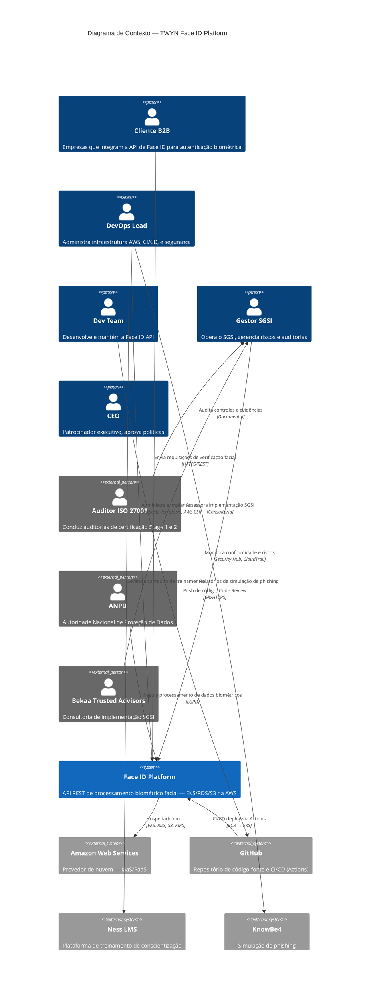
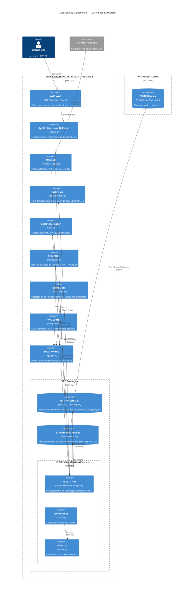
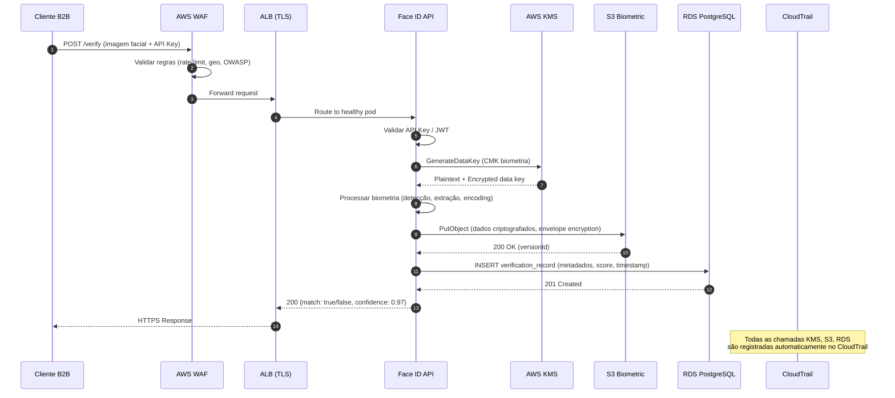
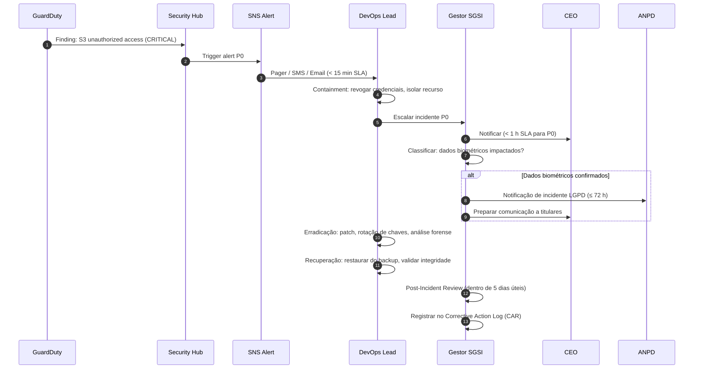
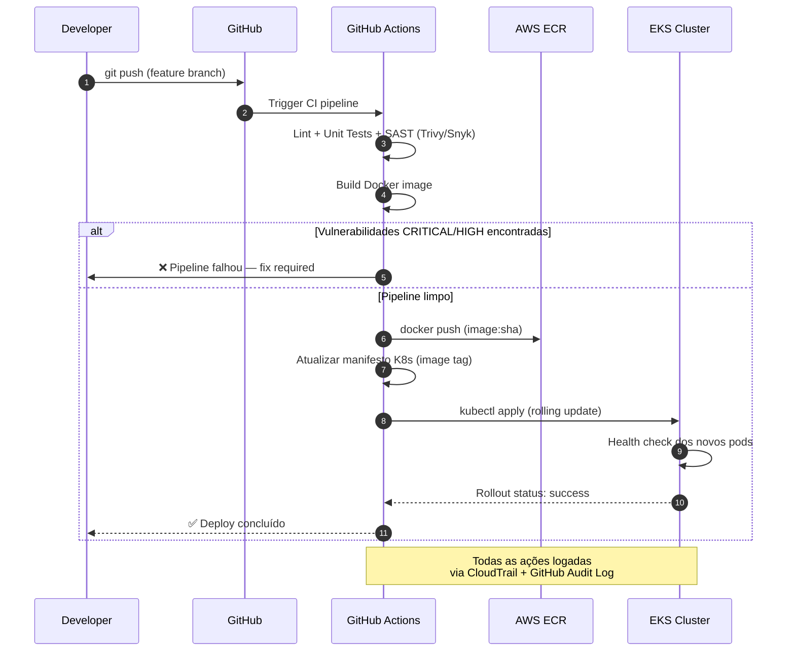
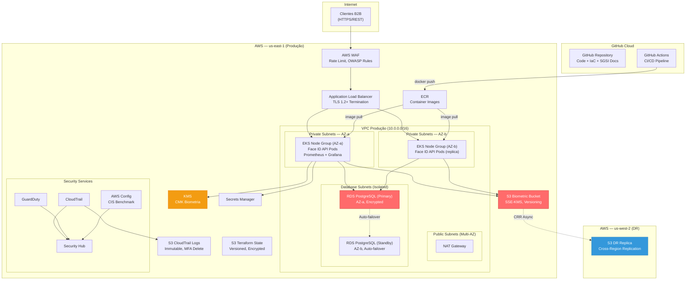
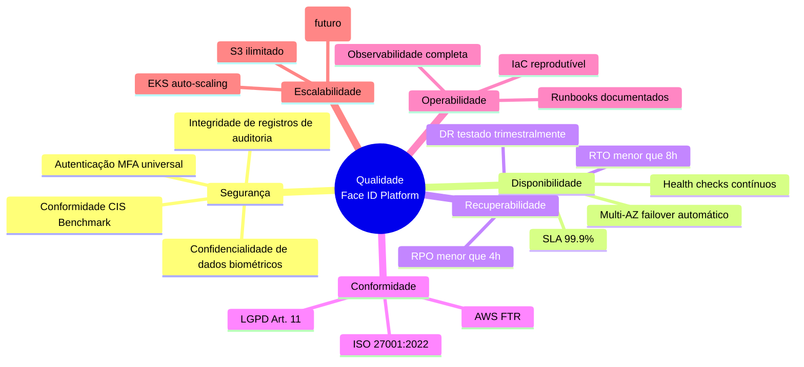

# Documento de Arquitetura — TWYN SGSI (Arc42)

| Metadado           | Valor                                                    |
|--------------------|----------------------------------------------------------|
| **Documento**      | SGSI-ARC42-001                                           |
| **Versão**         | 1.0                                                      |
| **Status**         | RASCUNHO                                                 |
| **Classificação**  | INTERNAL                                                 |
| **Autor**          | Bekaa Trusted Advisors                                   |
| **Data**           | 2026-06-02                                               |
| **Revisão**        | —                                                        |

---

## 1. Introdução e Objetivos

### 1.1 Visão Geral do Sistema

A **TWYN** opera uma **Face ID Platform API** — um serviço B2B de processamento de dados biométricos faciais hospedado integralmente na AWS. A empresa (~10 colaboradores) está em fase de transição _startup → scale-up_ e busca a certificação **ISO 27001:2022** até Q3 2026, com conformidade simultânea à **LGPD** e ao **AWS Foundational Technical Review (FTR)**.

Este documento descreve a arquitetura técnica e organizacional do **Sistema de Gestão de Segurança da Informação (SGSI)** que envolve a plataforma, cobrindo infraestrutura, fluxos de dados, controles de segurança e decisões arquiteturais.

### 1.2 Requisitos Essenciais de Negócio

| ID    | Requisito                                                         | Prioridade |
|-------|-------------------------------------------------------------------|------------|
| RN-01 | Certificação ISO 27001:2022 até Q3 2026                          | CRÍTICA    |
| RN-02 | Conformidade LGPD (Art. 11 — dados biométricos como sensíveis)   | CRÍTICA    |
| RN-03 | Aprovação AWS FTR (pré-requisito para marketplace AWS)           | ALTA       |
| RN-04 | SLA de disponibilidade ≥ 99.9 % para a API                      | ALTA       |
| RN-05 | RPO < 4 h / RTO < 8 h para recuperação de desastres             | ALTA       |
| RN-06 | Zero incidentes críticos de segurança com vazamento biométrico   | CRÍTICA    |
| RN-07 | Eliminar Single Point of Failure (DevOps Lead)                   | MÉDIA      |

### 1.3 Stakeholders

| Papel                 | Responsabilidade no SGSI                                   | Interno/Externo |
|-----------------------|------------------------------------------------------------|-----------------|
| CEO                   | Patrocinador executivo, aprovação de políticas e orçamento | Interno         |
| Gestor SGSI           | Operação diária do SGSI, análise de riscos, auditorias     | Interno         |
| DevOps Lead           | Administração AWS, CI/CD, IaC, segurança de infra          | Interno         |
| Dev Team              | Desenvolvimento seguro, OWASP, code review                 | Interno         |
| DPO / Jurídico        | Conformidade LGPD, DPIAs, contratos de DPA                 | Interno         |
| RH                    | Onboarding/offboarding, treinamento, NDAs                  | Interno         |
| Finanças              | Orçamento do SGSI (€60k–75k/ano)                          | Interno         |
| Auditor Externo       | Auditoria de certificação ISO 27001 (Stage 1 & 2)         | Externo         |
| Bekaa Trusted Advisors| Consultoria de implementação SGSI                          | Externo         |
| Clientes B2B          | Consumidores da Face ID API                                | Externo         |
| ANPD                  | Autoridade reguladora de proteção de dados (LGPD)          | Externo         |
| AWS                   | Provedor de nuvem, modelo de responsabilidade compartilhada| Externo         |

### 1.4 Objetivos de Segurança da Informação (Clause 6.2)

| # | Objetivo                                            | Meta Mensurável                    | Prazo     | Orçamento       |
|---|-----------------------------------------------------|------------------------------------|-----------|-----------------|
| 1 | Certificação ISO 27001                              | Certificado emitido                | Q3 2026   | €15k–20k        |
| 2 | Resolver bloqueadores AWS FTR                       | 4 GAPs fechados                    | Jun 2026  | ~$50/mês        |
| 3 | Zero incidentes críticos                            | MTTD <15 min, MTTR <4 h           | Contínuo  | —               |
| 4 | 100 % treinamento de conscientização                | < 5 % taxa de clique em phishing   | Ago 2026  | Incluso         |
| 5 | Eliminar SPOF DevOps                                | Junior DevOps contratado           | Jul 2026  | €40k–50k/ano    |
| 6 | DR funcional                                        | RPO <4 h, RTO <8 h testados       | Trimestral| Incluso         |

---

## 2. Restrições de Arquitetura

### 2.1 Restrições Técnicas

| Restrição                          | Descrição                                                                      |
|------------------------------------|--------------------------------------------------------------------------------|
| **Provedor de Nuvem**              | 100 % AWS — conta única `992382542028`                                         |
| **Região Primária**                | `us-east-1` (N. Virginia) — Multi-AZ                                          |
| **Região de DR**                   | `us-west-2` (Oregon) — Cross-Region Replication                               |
| **Orquestração de Contêineres**    | Amazon EKS (Kubernetes)                                                        |
| **Banco de Dados**                 | Amazon RDS PostgreSQL (Multi-AZ, criptografado)                                |
| **Armazenamento de Biometria**     | Amazon S3 (SSE-KMS, versionamento, replicação cross-region)                   |
| **IaC**                            | Terraform (estado em S3 versionado)                                            |
| **CI/CD**                          | GitHub Actions → AWS ECR → EKS                                                |
| **Criptografia**                   | TLS 1.2+ em trânsito, SSE-KMS em repouso (CMK dedicada)                      |
| **Identidade**                     | AWS IAM (RBAC), MFA obrigatório, rotação de chave 90 dias                     |

### 2.2 Restrições Organizacionais

| Restrição                          | Descrição                                                                      |
|------------------------------------|--------------------------------------------------------------------------------|
| **Tamanho da Equipe**              | ~10 colaboradores — startup em escala                                          |
| **Orçamento SGSI**                 | €60k–75k/ano (inclui certificação, ferramentas, contratação)                   |
| **SPOF**                           | DevOps Lead é proprietário de 11 ativos CRÍTICOS, sem backup humano            |
| **Regulação**                      | LGPD Art. 11 (dados biométricos = categoria especial), notificação ANPD ≤72 h |
| **Certificação alvo**              | ISO 27001:2022 (93 controles Annex A)                                          |
| **CIS Benchmark**                  | Conformidade com CIS AWS Foundations Benchmark via AWS Config                  |
| **OWASP**                          | OWASP Top 10 como referência para desenvolvimento seguro                      |

### 2.3 Convenções

| Convenção                          | Padrão                                                                         |
|------------------------------------|--------------------------------------------------------------------------------|
| **Classificação de dados**         | PUBLIC / INTERNAL / CONFIDENTIAL / RESTRICTED                                  |
| **Severity de incidentes**         | P0 (≤15 min) → P1 (≤4 h) → P2 (≤24 h) → P3 (≤72 h) → P4 (backlog)          |
| **Risco**                          | Score = Probabilidade (1–5) × Impacto (1–5); Crítico ≥ 20                     |
| **Tagging AWS**                    | `Environment`, `Owner`, `Classification`, `CostCenter`, `ManagedBy`           |
| **Documentação SGSI**              | ID no formato `SGSI-<TIPO>-<SEQ>`, Markdown, versionado em Git                |

---

## 3. Escopo e Contexto

### 3.1 Contexto de Negócio

A TWYN é uma **processadora de dados biométricos faciais** (B2B). Seus clientes integram a Face ID Platform API para autenticação/verificação de identidade. O sistema processa dados classificados como **RESTRICTED** pela LGPD (Art. 11 — dados biométricos sensíveis).

**Dentro do Escopo do SGSI:**
- Conta AWS `992382542028` (ambiente de produção)
- Face ID Platform API (EKS + RDS + S3)
- Pipelines CI/CD (GitHub Actions)
- Infraestrutura como Código (Terraform)
- Processamento e armazenamento de dados biométricos
- Todos os colaboradores que interagem com ativos de produção

**Fora do Escopo:**
- Laptops de desenvolvimento (não gerenciados)
- Website de marketing
- SaaS de terceiros (Slack, Google Workspace, etc.)

### 3.2 Diagrama de Contexto (C4 — Nível 1)

### 3.3 Contexto Técnico — Interfaces Externas

| Interface              | Protocolo      | Direção        | Classificação | Controle                             |
|------------------------|----------------|----------------|---------------|--------------------------------------|
| Cliente B2B → API      | HTTPS/REST     | Inbound        | RESTRICTED    | WAF, ALB, TLS 1.2+, API Keys        |
| GitHub Actions → ECR   | HTTPS          | Outbound       | CONFIDENTIAL  | OIDC Federation, least privilege IAM |
| ECR → EKS              | HTTPS (pull)   | Internal       | CONFIDENTIAL  | VPC Endpoint, IAM for SA             |
| API → RDS PostgreSQL   | TLS/PostgreSQL | Internal       | RESTRICTED    | Security Group, Secrets Manager      |
| API → S3 Biometric     | HTTPS (SDK)    | Internal       | RESTRICTED    | SSE-KMS, Bucket Policy, VPC Endpoint |
| CloudTrail → S3 Logs   | Internal       | Internal       | CONFIDENTIAL  | Log bucket immutável, MFA Delete     |
| GuardDuty → SNS        | Internal       | Outbound       | INTERNAL      | Alertas para equipe DevOps           |

---

## 4. Estratégia de Solução

### 4.1 Abordagem Geral

| Decisão                     | Estratégia Adotada                                                     |
|-----------------------------|------------------------------------------------------------------------|
| **Modelo de Hospedagem**    | Cloud-only (AWS), sem infraestrutura on-premise                        |
| **Arquitetura de Compute**  | Contêineres orquestrados por Kubernetes (EKS)                          |
| **Resiliência**             | Multi-AZ (produção) + Cross-Region DR (us-west-2)                     |
| **Infraestrutura**          | Infrastructure as Code (Terraform), imutável, versionado               |
| **Segurança em Camadas**    | Defense-in-depth: WAF → ALB → SG → Pod Security → App → Encryption   |
| **Observabilidade**         | CloudWatch + Prometheus + Grafana (on-cluster) + Security Hub          |
| **Conformidade Contínua**   | AWS Config Rules (CIS Benchmark), GuardDuty, Security Hub Score        |
| **SGSI Documental**         | Git-based (Markdown), versionado, revisável via Pull Request           |

### 4.2 Princípios Arquiteturais

1. **Least Privilege** — Cada identidade (humana ou serviço) recebe apenas as permissões mínimas necessárias
2. **Encrypt Everything** — Dados em trânsito (TLS 1.2+) e em repouso (SSE-KMS com CMK dedicada)
3. **Immutable Infrastructure** — Nenhuma alteração manual em produção; tudo via Terraform + Git
4. **Zero Trust Network** — VPC isolation, Security Groups restritivos, sem public IPs em workloads
5. **Auditabilidade Total** — CloudTrail para todas as chamadas API, logs imutáveis, retenção ≥ 2 anos
6. **Fail Secure** — Em caso de falha, o sistema nega acesso por padrão

### 4.3 Mapeamento de Qualidade → Estratégia

| Atributo de Qualidade | Estratégia Técnica                                              |
|------------------------|-----------------------------------------------------------------|
| **Confidencialidade**  | KMS CMK, RBAC, MFA, classificação de dados (4 níveis)          |
| **Integridade**        | S3 versionamento, checksums, log immutability, code signing     |
| **Disponibilidade**    | Multi-AZ, Auto-scaling EKS, RDS failover, health checks        |
| **Rastreabilidade**    | CloudTrail, CloudWatch Logs, Audit Trail no SGSI               |
| **Recuperabilidade**   | Cross-region replication S3, RDS snapshots, Terraform re-apply |

---

## 5. Visão de Blocos (Building Block View)

> 📐 **Detalhamento C4 Nível 3 (Componentes):** Para a decomposição completa dos componentes internos de cada contêiner, incluindo interfaces, operações, modelo de dados e mapeamento Annex A, consulte **[c4-components.md](./c4-components.md)**.

### 5.1 Diagrama de Contêineres (C4 — Nível 2)

### 5.2 Decomposição de Componentes Principais

#### Face ID API (Runtime)

| Componente              | Responsabilidade                                              |
|-------------------------|---------------------------------------------------------------|
| **API Gateway Layer**   | Autenticação de clientes (API Key / JWT), rate limiting       |
| **Biometric Engine**    | Processamento facial — detecção, extração, comparação         |
| **Data Access Layer**   | ORM/queries PostgreSQL, interface S3 para biometria           |
| **Audit Logger**        | Logging estruturado de todas as operações sensíveis           |
| **Health & Metrics**    | Endpoints `/health`, `/ready`, exportador Prometheus          |

#### Plataforma de Segurança AWS

| Componente              | Responsabilidade                                              |
|-------------------------|---------------------------------------------------------------|
| **IAM**                 | RBAC, MFA, federation, service accounts (IRSA)                |
| **KMS**                 | Gerenciamento de chaves criptográficas (CMK para biometria)   |
| **Secrets Manager**     | Rotação automática de credenciais de DB e API keys            |
| **WAF**                 | Proteção L7 contra OWASP Top 10 + rate limiting               |
| **Security Hub**        | Agregação e priorização de findings de segurança              |
| **GuardDuty**           | Detecção de ameaças baseada em ML (rede, DNS, S3, EKS)       |
| **Config**              | Avaliação contínua de conformidade CIS AWS Foundations        |
| **CloudTrail**          | Audit trail imutável de todas as chamadas API                 |

---

## 6. Visão de Runtime

### 6.1 Fluxo de Verificação Biométrica (Caso de Uso Principal)

### 6.2 Fluxo de Resposta a Incidentes P0 (Vazamento Biométrico)

### 6.3 Fluxo de CI/CD (Deploy para Produção)

---

## 7. Visão de Implantação (Deployment)

### 7.1 Diagrama de Deployment

### 7.2 Especificação dos Ambientes

| Ambiente     | Finalidade                   | Região     | Isolação            | Acesso                |
|--------------|------------------------------|------------|---------------------|-----------------------|
| **Produção** | Cargas de trabalho ao vivo   | us-east-1  | VPC dedicada        | DevOps Lead (admin)   |
| **Staging**  | Pré-produção, testes finais  | us-east-1  | VPC separada        | Dev Team + DevOps     |
| **Dev**      | Desenvolvimento / sandboxing | us-east-1  | VPC separada        | Dev Team              |
| **DR**       | Disaster Recovery            | us-west-2  | Cross-region replica| DevOps (break-glass)  |

### 7.3 Estratégia de Disaster Recovery

| Cenário                      | Resposta                                      | ETA Recuperação |
|------------------------------|-----------------------------------------------|-----------------|
| Falha de Região AWS          | Failover para us-west-2 (S3 + re-deploy EKS) | 4–6 h           |
| Ransomware                   | Isolamento, restauração de backups, forense    | 12–24 h         |
| Pessoa-chave indisponível    | Junior DevOps + consultor externo + runbooks   | 4–8 h           |

---

## 8. Conceitos Transversais (Cross-cutting Concerns)

### 8.1 Segurança

| Camada                 | Controles                                                                |
|------------------------|--------------------------------------------------------------------------|
| **Perímetro**          | WAF (OWASP rules), CloudFront (DDoS), Rate Limiting                     |
| **Rede**               | VPC isolation, Security Groups, NACLs, VPC Endpoints (S3, KMS, ECR)     |
| **Identidade**         | IAM RBAC, MFA obrigatório, IRSA para service accounts, 90-day rotation  |
| **Aplicação**          | Input validation, OWASP Top 10 mitigations, SAST (Trivy/Snyk)          |
| **Dados**              | SSE-KMS (AES-256), TLS 1.2+ in transit, classificação em 4 níveis      |
| **Auditoria**          | CloudTrail (all events), VPC Flow Logs, Application Audit Logs          |
| **Detecção de Ameaças**| GuardDuty (ML-based), Config Rules, Security Hub findings               |

### 8.2 Observabilidade

| Pilar          | Ferramenta                | Retenção      | Alertas                         |
|----------------|---------------------------|---------------|---------------------------------|
| **Métricas**   | Prometheus + Grafana      | 15 dias       | AlertManager → SNS              |
| **Logs**       | CloudWatch Logs           | 90 dias       | Metric Filters → Alarms         |
| **Traces**     | AWS X-Ray (planejado)     | 30 dias       | Latency anomaly detection       |
| **Audit Trail**| CloudTrail → S3           | 2 anos (min)  | EventBridge → Lambda → SNS      |
| **Segurança**  | Security Hub              | Contínuo      | Findings ≥ HIGH → SNS/Slack     |

### 8.3 Tratamento de Erros e Resiliência

| Pattern                | Implementação                                                  |
|------------------------|----------------------------------------------------------------|
| **Circuit Breaker**    | Falhas consecutivas em RDS/S3 → fail-fast, retry com backoff  |
| **Health Checks**      | Liveness + Readiness probes no EKS (HTTP `/health`, `/ready`) |
| **Graceful Degradation**| API retorna 503 com retry-after em caso de sobrecarga         |
| **Rollback Automático**| EKS rolling update com `maxUnavailable: 0`, rollback on fail  |
| **Backup Integrity**   | Checksum validation em restore, teste trimestral               |

### 8.4 Gestão de Dados e Privacidade (LGPD)

| Aspecto                    | Política                                                          |
|----------------------------|-------------------------------------------------------------------|
| **Base Legal**             | Consentimento explícito (Art. 11, LGPD) para dados biométricos   |
| **Minimização**            | Coletar apenas dados estritamente necessários para verificação    |
| **Retenção**               | Definida por contrato B2B, exclusão automatizada após período     |
| **Direitos do Titular**    | Acesso, correção, exclusão — SLA ≤ 15 dias úteis                |
| **Transferência Intl.**    | Dados em AWS us-east-1/us-west-2 — DPA com AWS, SCCs se necessário|
| **Notificação de Violação**| ANPD ≤ 72 h, titulares "sem demora injustificada"                |

### 8.5 Gestão de Configuração

| Item                       | Ferramenta          | Versionamento                   |
|----------------------------|---------------------|---------------------------------|
| **Infraestrutura**         | Terraform           | S3 state (versionado, encrypted)|
| **Aplicação (manifests)**  | K8s YAML + Helm     | Git (GitHub)                    |
| **Segredos**               | AWS Secrets Manager | Rotação automática 90 dias      |
| **Documentação SGSI**      | Markdown            | Git (GitHub)                    |
| **Políticas de segurança** | AWS Config Rules    | Terraform-managed               |

---

## 9. Decisões de Arquitetura (ADRs)

> As decisões abaixo são derivadas da análise do repositório SGSI e devem ser formalizadas como ADRs individuais conforme a skill `architecture-decision-records`.

### ADR-001: Cloud-Only na AWS (Single Provider)

| Campo     | Conteúdo                                                                          |
|-----------|-----------------------------------------------------------------------------------|
| **Status**    | Aceita                                                                        |
| **Contexto**  | Startup com ~10 pessoas, sem equipe para gerenciar infra on-premise           |
| **Decisão**   | 100 % AWS, conta única, modelo de responsabilidade compartilhada              |
| **Consequência** | Vendor lock-in aceito; simplifica compliance (1 provedor, 1 SLA); risco de dependência de disponibilidade AWS mitigado com Multi-AZ + Multi-Region |

### ADR-002: EKS para Orquestração de Contêineres

| Campo     | Conteúdo                                                                          |
|-----------|-----------------------------------------------------------------------------------|
| **Status**    | Aceita                                                                        |
| **Contexto**  | API precisa de escalabilidade, deploys frequentes, e isolamento de workloads  |
| **Decisão**   | Amazon EKS (Kubernetes gerenciado) com node groups em Multi-AZ               |
| **Consequência** | Complexidade operacional alta para equipe pequena (SPOF DevOps); mitigado com contratação de Junior DevOps e runbooks |

### ADR-003: Envelope Encryption com KMS CMK para Dados Biométricos

| Campo     | Conteúdo                                                                          |
|-----------|-----------------------------------------------------------------------------------|
| **Status**    | Aceita                                                                        |
| **Contexto**  | Dados biométricos faciais são RESTRICTED (LGPD Art. 11), exigem máxima proteção|
| **Decisão**   | SSE-KMS com Customer Managed Key dedicada; envelope encryption no S3          |
| **Consequência** | Custo adicional KMS (~$1/CMK/mês + $0.03/10k requests); controle total de key rotation; auditável via CloudTrail |

### ADR-004: Git-Based SGSI Documentation

| Campo     | Conteúdo                                                                          |
|-----------|-----------------------------------------------------------------------------------|
| **Status**    | Aceita                                                                        |
| **Contexto**  | Documentação do SGSI precisa ser versionada, revisável e auditável            |
| **Decisão**   | Toda documentação em Markdown, versionada no GitHub, revisões via PR          |
| **Consequência** | Rastreabilidade total via Git history; exige que stakeholders não-técnicos (CEO, HR) usem ou recebam exports; evita ferramentas proprietárias |

### ADR-005: Terraform como IaC Exclusivo

| Campo     | Conteúdo                                                                          |
|-----------|-----------------------------------------------------------------------------------|
| **Status**    | Aceita                                                                        |
| **Contexto**  | Infraestrutura deve ser reprodutível, auditável e sem drift                   |
| **Decisão**   | Terraform com state em S3 (versionado + DynamoDB lock)                        |
| **Consequência** | Zero alterações manuais em produção (imutável); state file é ativo CRÍTICO; requer Terraform expertise (concentrado no DevOps Lead) |

### ADR-006: Cross-Region DR com S3 Replication (Warm Standby)

| Campo     | Conteúdo                                                                          |
|-----------|-----------------------------------------------------------------------------------|
| **Status**    | Aceita                                                                        |
| **Contexto**  | RPO < 4h, RTO < 8h exigidos; custo deve ser proporcional ao estágio da empresa|
| **Decisão**   | Cross-Region Replication S3 (us-east-1 → us-west-2); RDS snapshots copiados; EKS recriado via Terraform em DR |
| **Consequência** | Warm standby (não hot); EKS re-deploy leva 4-6h; aceitável para perfil de risco atual; teste trimestral obrigatório |

---

## 10. Requisitos de Qualidade

### 10.1 Árvore de Qualidade

### 10.2 Cenários de Qualidade

| ID   | Atributo         | Cenário                                                                 | Métrica Esperada     | Prioridade |
|------|------------------|-------------------------------------------------------------------------|----------------------|------------|
| QA-01| Confidencialidade| Tentativa de acesso não autorizado a bucket S3 biométrico               | Bloqueio + alerta <15 min | CRÍTICA |
| QA-02| Disponibilidade  | Falha de uma AZ em us-east-1                                           | Failover automático, 0 downtime | ALTA |
| QA-03| Recuperabilidade | Perda total da região us-east-1                                        | Serviço restaurado em <8 h | ALTA |
| QA-04| Integridade      | Tentativa de modificação de logs CloudTrail                             | Detecção imediata, logs imutáveis | CRÍTICA |
| QA-05| Performance      | 1000 requisições de verificação facial simultâneas                      | P95 latência < 2 s | MÉDIA |
| QA-06| Conformidade     | Auditoria ISO 27001 Stage 2                                            | Zero não-conformidades maiores | CRÍTICA |
| QA-07| Operabilidade    | DevOps Lead indisponível por 2 semanas                                  | Operações continuam via Junior + runbooks | ALTA |
| QA-08| Auditabilidade   | Investigação forense pós-incidente                                      | Logs completos disponíveis por 2 anos | ALTA |

---

## 11. Riscos e Dívida Técnica

### 11.1 Riscos Arquiteturais Ativos

| ID       | Risco                                      | Score | Classificação | Tratamento            | Responsável   |
|----------|--------------------------------------------|-------|---------------|-----------------------|---------------|
| RISK-001 | Vazamento de dados biométricos S3          | 25    | CRÍTICO       | Mitigar (RTP-001)     | DevOps Lead   |
| RISK-003 | Acesso não autorizado via Root Account     | 20    | CRÍTICO       | Mitigar (RTP-003)     | DevOps Lead   |
| RISK-007 | Ataque de ransomware em contêineres        | 20    | CRÍTICO       | Mitigar (RTP-007)     | DevOps Lead   |
| RISK-015 | DevOps Lead como Single Point of Failure   | 16    | ALTO          | Mitigar (contratar)   | CEO           |
| RISK-012 | Falta de treinamento de conscientização    | 15    | ALTO          | Mitigar (treinamento) | Gestor SGSI   |
| RISK-009 | Chave IAM não rotacionada (tmpsaasboost)   | 12    | ALTO          | Mitigar (FTR)         | DevOps Lead   |

### 11.2 Dívida Técnica

| Item                                         | Impacto                                     | Prioridade | Prazo Est. |
|----------------------------------------------|---------------------------------------------|------------|------------|
| SOPs incompletos (SOP-001 a SOP-005)         | Não-conformidade Annex A                    | ALTA       | Jul 2026   |
| AWS Config não habilitado (CIS Benchmarks)   | Sem conformidade contínua automatizada      | CRÍTICA    | Jun 2026   |
| Testes de DR nunca executados                 | RPO/RTO não validados                       | ALTA       | Jun 2026   |
| MFA ausente na Root Account                  | Risco Crítico 20, FTR blocker               | CRÍTICA    | Jun 2026   |
| IAM user orphaned (tmpsaasboost)             | Chave exposta, FTR blocker                  | ALTA       | Jun 2026   |
| X-Ray não implementado (tracing)            | Observabilidade incompleta                  | BAIXA      | Q4 2026    |
| Gestor SGSI não formalmente designado        | ISO blocker (Clause 5.3)                    | CRÍTICA    | Jun 2026   |
| CEO não assinou IS Policy                    | Falha automática de auditoria ISO           | CRÍTICA    | Jul 2026   |

### 11.3 Estado de Conformidade Annex A

| Status               | Controles | Percentual |
|----------------------|-----------|------------|
| ✅ Implementado      | 29        | 31 %       |
| 🟡 Parcial           | 36        | 39 %       |
| ❌ Não Implementado  | 16        | 17 %       |
| ⬜ N/A               | 12        | 13 %       |
| **Total**            | **93**    | **70 %**   |

> **Meta:** 100 % (Implementado + N/A justificado) até Q3 2026.

---

## 12. Glossário

| Termo     | Definição                                                                                    |
|-----------|----------------------------------------------------------------------------------------------|
| **SGSI**  | Sistema de Gestão de Segurança da Informação (equivalente a ISMS em inglês)                 |
| **LGPD**  | Lei Geral de Proteção de Dados (Lei nº 13.709/2018)                                         |
| **ANPD**  | Autoridade Nacional de Proteção de Dados                                                     |
| **SoA**   | Statement of Applicability — declaração de aplicabilidade dos 93 controles Annex A           |
| **RTP**   | Risk Treatment Plan — plano de tratamento de riscos                                          |
| **CIA**   | Confidencialidade, Integridade e Disponibilidade                                             |
| **FTR**   | AWS Foundational Technical Review                                                            |
| **CIS**   | Center for Internet Security — benchmark de configuração segura                              |
| **EKS**   | Elastic Kubernetes Service — orquestrador de contêineres gerenciado da AWS                   |
| **RDS**   | Relational Database Service — banco de dados gerenciado da AWS                               |
| **KMS**   | Key Management Service — gerenciamento de chaves criptográficas da AWS                       |
| **CMK**   | Customer Managed Key — chave criptográfica controlada pelo cliente no KMS                    |
| **SSE**   | Server-Side Encryption — criptografia no lado do servidor                                    |
| **IRSA**  | IAM Roles for Service Accounts — federação de identidade entre K8s e IAM                    |
| **RBAC**  | Role-Based Access Control — controle de acesso baseado em papéis                             |
| **MFA**   | Multi-Factor Authentication — autenticação multifator                                        |
| **MTTD**  | Mean Time to Detect — tempo médio para detectar um incidente                                 |
| **MTTR**  | Mean Time to Respond/Recover — tempo médio para responder/recuperar de um incidente          |
| **RPO**   | Recovery Point Objective — ponto máximo de perda de dados aceitável                          |
| **RTO**   | Recovery Time Objective — tempo máximo de indisponibilidade aceitável                        |
| **SPOF**  | Single Point of Failure — ponto único de falha                                               |
| **DPA**   | Data Processing Agreement — acordo de processamento de dados                                 |
| **NDA**   | Non-Disclosure Agreement — acordo de confidencialidade                                       |
| **SAST**  | Static Application Security Testing — análise estática de segurança de código                |
| **SBOM**  | Software Bill of Materials — inventário de componentes de software                           |
| **IaC**   | Infrastructure as Code — infraestrutura como código                                          |
| **CAR**   | Corrective Action Report/Request — registro de ação corretiva                                |
| **ADR**   | Architecture Decision Record — registro de decisão arquitetural                              |

---

## Apêndice A — Referências Cruzadas SGSI

| Seção Arc42 | Documentos SGSI Relacionados                                                     |
|-------------|----------------------------------------------------------------------------------|
| §1          | `SGSI-SCOPE-001`, `SGSI-OBJ-001`                                                |
| §2          | `SGSI-POLICY-001`, `SGSI-POLICY-002`                                             |
| §3          | `SGSI-SCOPE-001` (escopo), `SGSI-ASSETS-001` (inventário)                       |
| §5          | `SGSI-ASSETS-001` (ativos de infraestrutura e software)                          |
| §6          | `SGSI-POLICY-003` (incidentes), `SGSI-POLICY-001` §17–19 (operações/CI/CD)      |
| §7          | `SGSI-POLICY-005` (backup), `SGSI-POLICY-006` (BCP)                             |
| §8          | `SGSI-POLICY-001`–`007`, `SGSI-SOA-001`, `SGSI-RACI-001`                        |
| §9          | ADRs (a serem formalizados)                                                       |
| §10         | `SGSI-OBJ-001` (objetivos), `SGSI-RISK-001` (metodologia)                       |
| §11         | `SGSI-RISK-002` (registro), `SGSI-RTP-001`, `SGSI-CAR-001`, `SGSI-SOA-001`      |
| §12         | `GLOSSARY.md`                                                                     |

---

> **Próximos Passos:**
> 1. ⬜ Revisão e aprovação deste documento pelo Gestor SGSI e CEO
> 2. ⬜ Formalizar ADRs individuais (skill `architecture-decision-records`)
> 3. ✅ Detalhar diagramas C4 Nível 3 (Componentes) → [c4-components.md](./c4-components.md)
> 4. ⬜ Integrar resultados da primeira auditoria interna (IA-001, Jul 2026)
> 5. ⬜ Atualizar após resolução dos 4 CARs abertos e 8 GAPs

---

*Documento gerado com base no framework [Arc42](https://arc42.org) e no modelo [C4](https://c4model.com).*
*Última atualização: 2026-06-02*
