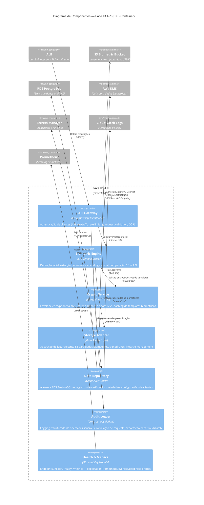
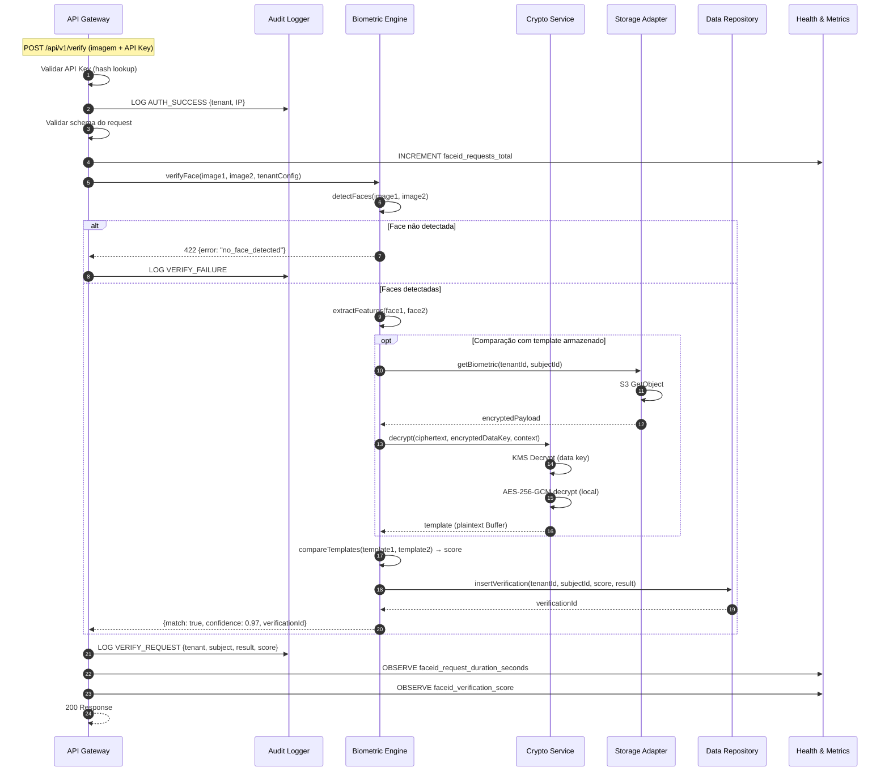
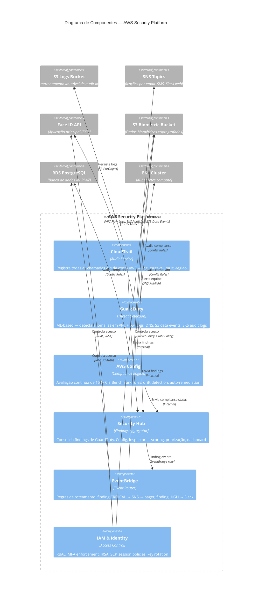
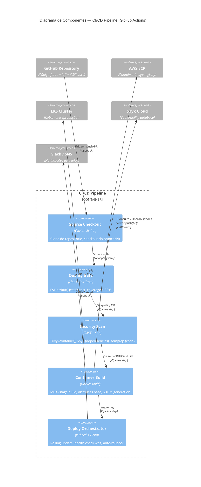
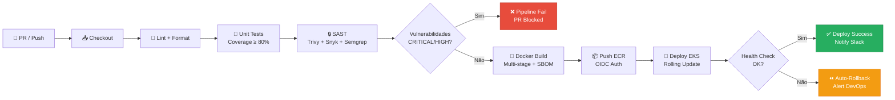
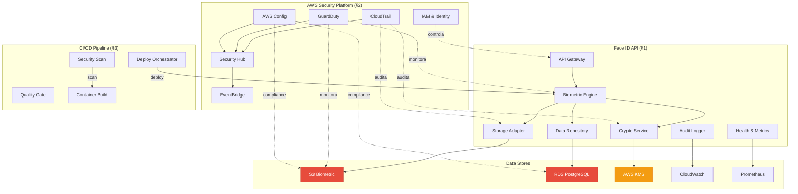

# C4 Component Level — TWYN Face ID Platform

| Metadado           | Valor                                                    |
|--------------------|----------------------------------------------------------|
| **Documento**      | SGSI-C4-COMP-001                                         |
| **Versão**         | 1.0                                                      |
| **Status**         | RASCUNHO                                                 |
| **Classificação**  | INTERNAL                                                 |
| **Autor**          | Bekaa Trusted Advisors                                   |
| **Data**           | 2026-06-02                                               |
| **Referência**     | [arc42.md](./arc42.md) — Seção 5                         |

> Este documento detalha os **componentes internos (C4 Nível 3)** dos contêineres identificados no [Diagrama de Contêineres (Nível 2)](./arc42.md#51-diagrama-de-contêineres-c4--nível-2).

---

## Índice de Contêineres Decompostos

| Contêiner                     | Seção | Componentes |
|-------------------------------|-------|-------------|
| Face ID API (EKS)             | §1    | 7           |
| AWS Security Platform         | §2    | 6           |
| CI/CD Pipeline (GitHub Actions)| §3   | 5           |

---

## 1. Face ID API — Diagrama de Componentes

### 1.1 Diagrama C4 Component



### 1.2 Detalhamento dos Componentes

---

#### 1.2.1 API Gateway

| Atributo        | Valor                                                               |
|-----------------|---------------------------------------------------------------------|
| **Nome**        | API Gateway                                                         |
| **Tipo**        | Middleware Layer                                                    |
| **Tecnologia**  | Express.js / Fastify (middleware chain)                             |
| **Finalidade**  | Ponto de entrada único para todas as requisições de clientes B2B    |

**Features:**
- Autenticação de clientes via API Key (header `X-API-Key`) ou Bearer JWT
- Validação de schema de request (JSON Schema / Zod)
- Rate limiting por cliente (token bucket, configurable per-tenant)
- CORS enforcement (whitelist de origens B2B)
- Request ID injection (`X-Request-Id`) para correlação
- Input sanitization contra injection attacks

**Interface:**

| Operação | Método | Rota | Descrição |
|----------|--------|------|-----------|
| `verifyFace` | `POST` | `/api/v1/verify` | Verificação 1:1 (duas imagens) |
| `identifyFace` | `POST` | `/api/v1/identify` | Identificação 1:N (busca em galeria) |
| `enrollFace` | `POST` | `/api/v1/enroll` | Cadastro de novo template biométrico |
| `deleteFace` | `DELETE` | `/api/v1/subjects/{id}` | Exclusão de dados (LGPD Art. 18) |
| `healthCheck` | `GET` | `/health` | Liveness probe |
| `readyCheck` | `GET` | `/ready` | Readiness probe (checa DB + S3) |
| `metrics` | `GET` | `/metrics` | Prometheus metrics endpoint |

**Controles de Segurança:**
- A.5.17 (Informação de autenticação) — API keys rotacionadas via Secrets Manager
- A.8.3 (Restrição de acesso à informação) — RBAC por tenant
- A.8.6 (Gestão de capacidade) — Rate limiting previne abuso

---

#### 1.2.2 Biometric Engine

| Atributo        | Valor                                                               |
|-----------------|---------------------------------------------------------------------|
| **Nome**        | Biometric Engine                                                    |
| **Tipo**        | Core Domain Service                                                 |
| **Tecnologia**  | Python/C++ binding (ex: dlib, InsightFace) ou SDK proprietário      |
| **Finalidade**  | Processamento central de biometria facial                           |

**Features:**
- **Detecção facial** — localização de faces em imagens (bounding boxes)
- **Extração de features** — geração de embedding vetorial (template biométrico)
- **Comparação 1:1** — verificação de similaridade entre dois templates (score 0–1)
- **Comparação 1:N** — busca em galeria de templates cadastrados (top-k matches)
- **Liveness detection** — anti-spoofing (detecção de foto/vídeo de replay)
- **Normalização** — alinhamento facial, correção de iluminação e pose

**Regras de Negócio:**
- Threshold de match configurável por cliente (default: 0.85)
- Imagens rejeitadas se não houver face detectada (erro 422)
- Templates armazenados apenas em formato vetorial (sem imagem raw persistida)
- Processamento síncrono (latência alvo P95 < 2s)

**Controles de Segurança:**
- A.5.33 (Proteção de registros) — templates biométricos = RESTRICTED
- A.8.11 (Mascaramento de dados) — scores e metadados são CONFIDENTIAL, templates RESTRICTED

---

#### 1.2.3 Crypto Service

| Atributo        | Valor                                                               |
|-----------------|---------------------------------------------------------------------|
| **Nome**        | Crypto Service                                                      |
| **Tipo**        | Encryption Module                                                   |
| **Tecnologia**  | AWS SDK (KMS client), Node.js `crypto` module                       |
| **Finalidade**  | Gerenciamento de criptografia para dados biométricos em repouso     |

**Features:**
- **Envelope Encryption** — gera data key via KMS, criptografa localmente, armazena encrypted data key junto ao ciphertext
- **Key Caching** — cache de data keys com TTL para reduzir chamadas KMS
- **Decrypt on demand** — descriptografa templates biométricos apenas durante comparação
- **Hashing** — SHA-256 de templates para verificação de integridade

**Interface:**

```
encrypt(plaintext: Buffer, context: EncryptionContext) → { ciphertext: Buffer, encryptedDataKey: Buffer }
decrypt(ciphertext: Buffer, encryptedDataKey: Buffer, context: EncryptionContext) → Buffer
hash(data: Buffer) → string
```

**Dependências:**
- AWS KMS — CMK `alias/twyn-biometric-key` (AES-256-GCM)
- Encryption Context inclui: `tenant_id`, `subject_id`, `purpose` (para auditoria no CloudTrail)

**Controles de Segurança:**
- A.8.24 (Uso de criptografia) — AES-256-GCM via KMS CMK
- A.8.25 (Ciclo de vida de chaves) — rotação automática anual da CMK
- A.5.33 (Proteção de registros) — encryption context garante rastreabilidade

---

#### 1.2.4 Storage Adapter

| Atributo        | Valor                                                               |
|-----------------|---------------------------------------------------------------------|
| **Nome**        | Storage Adapter                                                     |
| **Tipo**        | Data Access Layer (S3)                                              |
| **Tecnologia**  | AWS SDK v3 (S3 Client)                                              |
| **Finalidade**  | Abstração de acesso ao S3 Biometric Bucket                         |

**Features:**
- **Write** — `PutObject` com SSE-KMS, metadata tags (`Classification: RESTRICTED`)
- **Read** — `GetObject` com decrypt transparente via KMS
- **Delete** — `DeleteObject` para atender direitos do titular (LGPD Art. 18)
- **Signed URLs** — geração de presigned URLs temporárias (TTL 5 min) para upload direto
- **Lifecycle** — configuração de regras de retenção por tenant
- **Integrity** — checksum MD5/SHA-256 em upload, verificação em download

**Interface:**

```
putBiometric(tenantId, subjectId, data: EncryptedPayload) → { key: string, versionId: string }
getBiometric(tenantId, subjectId) → EncryptedPayload
deleteBiometric(tenantId, subjectId) → void
generateUploadUrl(tenantId, subjectId, ttl: number) → string
```

**Controles de Segurança:**
- A.8.10 (Exclusão de informação) — delete com versionamento (soft delete, hard delete após retenção)
- A.8.13 (Backup de informação) — Cross-Region Replication para us-west-2
- A.8.24 (Uso de criptografia) — SSE-KMS obrigatório (bucket policy deny sem encryption)

---

#### 1.2.5 Data Repository

| Atributo        | Valor                                                               |
|-----------------|---------------------------------------------------------------------|
| **Nome**        | Data Repository                                                     |
| **Tipo**        | ORM / Query Layer                                                   |
| **Tecnologia**  | Prisma / TypeORM / Knex.js sobre PostgreSQL                        |
| **Finalidade**  | Acesso estruturado ao RDS PostgreSQL                                |

**Features:**
- **Verification Records** — CRUD de registros de verificação (resultado, score, timestamp, tenant)
- **Client Config** — configurações por tenant (threshold, rate limit, webhook URL)
- **Audit Entries** — inserção de registros de auditoria aplicacional
- **Connection Pooling** — pool de conexões com health check e retry
- **Migrations** — schema migrations versionadas e reversíveis

**Modelo de Dados Principal:**

```
┌──────────────────────┐     ┌──────────────────────┐
│ tenants              │     │ subjects             │
├──────────────────────┤     ├──────────────────────┤
│ id (UUID, PK)        │──┐  │ id (UUID, PK)        │
│ name                 │  │  │ tenant_id (FK)       │
│ api_key_hash         │  │  │ external_ref         │
│ match_threshold      │  │  │ s3_key               │
│ rate_limit           │  └──│ created_at           │
│ webhook_url          │     │ deleted_at           │
│ created_at           │     └──────────────────────┘
└──────────────────────┘              │
                                      │
┌──────────────────────┐              │
│ verifications        │              │
├──────────────────────┤              │
│ id (UUID, PK)        │              │
│ tenant_id (FK)       │──────────────┘
│ subject_id (FK)      │
│ match_result (bool)  │
│ confidence_score     │
│ request_id           │
│ ip_address           │
│ duration_ms          │
│ created_at           │
└──────────────────────┘
```

**Controles de Segurança:**
- A.8.25 (Ciclo de vida de chaves) — `api_key_hash` armazena apenas hash (bcrypt/argon2), nunca plaintext
- A.5.33 (Proteção de registros) — registros de verificação retidos ≥ 2 anos
- A.8.7 (Proteção contra malware) — prepared statements contra SQL injection

---

#### 1.2.6 Audit Logger

| Atributo        | Valor                                                               |
|-----------------|---------------------------------------------------------------------|
| **Nome**        | Audit Logger                                                        |
| **Tipo**        | Cross-cutting Module                                                |
| **Tecnologia**  | Winston / Pino (structured JSON logging)                            |
| **Finalidade**  | Registrar operações sensíveis para conformidade e forense           |

**Features:**
- **Structured Logging** — JSON com campos padronizados (`timestamp`, `request_id`, `tenant_id`, `action`, `actor`, `resource`, `result`)
- **Sensitive Data Redaction** — mascaramento automático de dados biométricos, tokens, e PII nos logs
- **Correlation** — propagação de `X-Request-Id` em toda a cadeia de componentes
- **Async Batching** — envio assíncrono para CloudWatch Logs (non-blocking)
- **Log Levels** — `AUDIT` (sempre), `ERROR`, `WARN`, `INFO`, `DEBUG` (configurável por ambiente)

**Eventos Auditados:**

| Evento | Nível | Dados Registrados |
|--------|-------|-------------------|
| `AUTH_SUCCESS` | AUDIT | tenant_id, IP, method |
| `AUTH_FAILURE` | AUDIT | IP, reason, API key prefix |
| `VERIFY_REQUEST` | AUDIT | tenant_id, subject_id, result, confidence |
| `ENROLL_SUBJECT` | AUDIT | tenant_id, subject_id |
| `DELETE_SUBJECT` | AUDIT | tenant_id, subject_id (LGPD compliance) |
| `KMS_OPERATION` | AUDIT | key_id, operation, encryption_context |
| `ERROR_UNHANDLED` | ERROR | stack trace, request context |

**Controles de Segurança:**
- A.8.15 (Registro de eventos) — todos os acessos a dados RESTRICTED logados
- A.8.17 (Sincronização de relógio) — NTP via Amazon Time Sync Service
- A.5.28 (Coleta de evidências) — logs imutáveis em CloudWatch + S3

---

#### 1.2.7 Health & Metrics

| Atributo        | Valor                                                               |
|-----------------|---------------------------------------------------------------------|
| **Nome**        | Health & Metrics                                                    |
| **Tipo**        | Observability Module                                                |
| **Tecnologia**  | prom-client (Node.js Prometheus exporter)                           |
| **Finalidade**  | Expor saúde da aplicação e métricas operacionais                    |

**Endpoints:**

| Rota | Finalidade | Consumidor |
|------|-----------|------------|
| `GET /health` | Liveness — processo está vivo | EKS kubelet |
| `GET /ready` | Readiness — DB + S3 acessíveis | EKS kubelet + ALB |
| `GET /metrics` | Métricas Prometheus | Prometheus scraper |

**Métricas Exportadas:**

| Métrica | Tipo | Labels | Descrição |
|---------|------|--------|-----------|
| `faceid_requests_total` | Counter | `method`, `status`, `tenant` | Total de requisições |
| `faceid_request_duration_seconds` | Histogram | `method`, `tenant` | Latência por operação |
| `faceid_verification_score` | Histogram | `tenant`, `result` | Distribuição de scores |
| `faceid_active_connections` | Gauge | — | Conexões DB ativas |
| `faceid_kms_operations_total` | Counter | `operation`, `status` | Chamadas KMS |
| `faceid_s3_operations_total` | Counter | `operation`, `status` | Operações S3 |
| `faceid_errors_total` | Counter | `type`, `component` | Erros por componente |

**Controles de Segurança:**
- A.8.6 (Gestão de capacidade) — métricas alimentam alertas de capacidade
- A.8.16 (Monitoramento de atividades) — anomalias detectadas via thresholds em Grafana

---

### 1.3 Diagrama de Sequência — Fluxo Interno de Verificação



---

## 2. AWS Security Platform — Diagrama de Componentes

### 2.1 Diagrama C4 Component



### 2.2 Detalhamento dos Componentes

---

#### 2.2.1 CloudTrail

| Atributo        | Valor                                                               |
|-----------------|---------------------------------------------------------------------|
| **Tipo**        | AWS Managed Service — Audit Logging                                 |
| **Finalidade**  | Registro imutável de TODAS as chamadas API na conta AWS             |

**Configuração:**
- Trail multi-região (all regions)
- Management events: Read + Write
- Data events: S3 (biometric bucket), KMS, Lambda
- Log file validation: Enabled (digest files)
- S3 bucket: MFA Delete habilitado, lifecycle → Glacier após 90 dias
- Retenção: ≥ 2 anos (compliance LGPD + ISO)

**Controles Annex A:** A.8.15, A.8.17, A.5.28

---

#### 2.2.2 GuardDuty

| Atributo        | Valor                                                               |
|-----------------|---------------------------------------------------------------------|
| **Tipo**        | AWS Managed Service — Threat Intelligence & ML                      |
| **Finalidade**  | Detecção automatizada de ameaças e anomalias                        |

**Protection Plans Habilitados:**

| Plan | Fonte de Dados | Ameaças Detectadas |
|------|---------------|--------------------|
| **Foundational** | CloudTrail, VPC Flow Logs, DNS | Credential compromise, C2 communication |
| **S3 Protection** | S3 data events | Unauthorized access, data exfiltration |
| **EKS Protection** | EKS audit logs | Privileged containers, anomalous API calls |
| **Malware Protection** | EBS volumes | Malware em workloads |

**SLA de Detecção:** MTTD alvo < 15 minutos (finding → alert)

**Controles Annex A:** A.8.16, A.5.7, A.8.7

---

#### 2.2.3 AWS Config

| Atributo        | Valor                                                               |
|-----------------|---------------------------------------------------------------------|
| **Tipo**        | AWS Managed Service — Compliance Engine                             |
| **Finalidade**  | Conformidade contínua automatizada com CIS Benchmark                |

**Status:** ⚠️ **NÃO IMPLEMENTADO** (CAR-003, GAP-003 — FTR Blocker)

**Configuração Planejada:**

| Config Rule Pack | Rules | Exemplos |
|-----------------|-------|----------|
| CIS AWS Foundations 1.4 | ~50 | root-account-mfa, iam-password-policy, s3-bucket-public-read |
| AWS Security Best Practices | ~30 | encrypted-volumes, rds-encryption, vpc-flow-logs |
| Custom Rules (Terraform) | ~10 | biometric-bucket-policy, eks-pod-security |

**Custo Estimado:** ~$50/mês

**Controles Annex A:** A.5.36, A.8.9, A.8.34

---

#### 2.2.4 Security Hub

| Atributo        | Valor                                                               |
|-----------------|---------------------------------------------------------------------|
| **Tipo**        | AWS Managed Service — Findings Aggregator                           |
| **Finalidade**  | Painel unificado de postura de segurança                            |

**Integrações:**

```
CloudTrail ──────┐
GuardDuty ───────┤
AWS Config ──────┼──→ Security Hub ──→ EventBridge ──→ SNS ──→ Equipe
Inspector ───────┤                          │
Firewall Manager─┘                    ┌─────┴──────┐
                                      │ Dashboards │
                                      │ Score      │
                                      └────────────┘
```

**Security Score Target:** ≥ 90 % (atualmente: a ser medido após GAP-003)

**Controles Annex A:** A.5.7, A.8.16

---

#### 2.2.5 EventBridge

| Atributo        | Valor                                                               |
|-----------------|---------------------------------------------------------------------|
| **Tipo**        | AWS Managed Service — Event Router                                  |
| **Finalidade**  | Roteamento inteligente de eventos de segurança para notificação     |

**Regras Configuradas:**

| Regra | Fonte | Condição | Destino | SLA |
|-------|-------|----------|---------|-----|
| `critical-finding` | Security Hub | severity = CRITICAL | SNS → Pager (DevOps + Gestor) | < 15 min |
| `high-finding` | Security Hub | severity = HIGH | SNS → Email + Slack | < 1 h |
| `root-login` | CloudTrail | userIdentity.type = Root | SNS → Pager (todos) | Imediato |
| `s3-public-access` | Config | rule = s3-bucket-public-read, NONCOMPLIANT | SNS + Lambda (auto-remediate) | < 5 min |
| `guardduty-eks` | GuardDuty | resource.type = EKSCluster | SNS → DevOps | < 15 min |

**Controles Annex A:** A.5.24, A.5.25, A.5.26

---

#### 2.2.6 IAM & Identity

| Atributo        | Valor                                                               |
|-----------------|---------------------------------------------------------------------|
| **Tipo**        | AWS Managed Service — Identity & Access Management                  |
| **Finalidade**  | Controle de acesso centralizado para todos os recursos AWS          |

**Matriz RBAC (IAM Policies):**

| Role | Tipo | Permissões | MFA | Condição |
|------|------|-----------|-----|----------|
| `TwynCEO` | IAM User | ReadOnly (billing + console) | Virtual MFA | — |
| `TwynGestorSGSI` | IAM User | SecurityAudit + ReadOnly | Virtual MFA | — |
| `TwynDevOpsLead` | IAM User | AdministratorAccess | Hardware MFA | IP restriction |
| `TwynJuniorDevOps` | IAM User | PowerUserAccess (scoped) | Virtual MFA | IP restriction |
| `TwynDeveloper` | IAM User | EKS + ECR + CloudWatch (limited) | Virtual MFA | VPN only |
| `TwynExternalAuditor` | IAM Role | SecurityAudit (read-only) | Session MFA | Time-boxed (30 days) |
| `face-id-api-sa` | IRSA (K8s SA) | S3 biometric, KMS, Secrets Manager | N/A (pod identity) | Namespace scoped |

**Root Account Policy:**
- ❌ Access keys: **DELETADAS** (ou a deletar — CAR-001)
- 🔑 MFA: Hardware MFA (YubiKey) — **PENDENTE** (GAP-001)
- 🔒 Armazenamento: Cofre físico
- 🚨 Uso: Break-glass only — CloudTrail alert imediato
- 📋 Procedimento: Requer 2 pessoas (dual control)

**Controles Annex A:** A.5.15, A.5.16, A.5.17, A.5.18, A.8.2, A.8.3, A.8.5

---

## 3. CI/CD Pipeline — Diagrama de Componentes

### 3.1 Diagrama C4 Component



### 3.2 Pipeline Stages



**Controles Annex A:** A.8.25 (secure development), A.8.27 (secure architecture), A.8.28 (secure coding), A.8.31 (separation of environments), A.8.32 (change management)

---

## 4. Visão Consolidada — Interações entre Contêineres



---

## Apêndice — Mapeamento Componentes × Controles Annex A

| Componente | Controles Annex A Implementados |
|------------|--------------------------------|
| API Gateway | A.5.17, A.8.3, A.8.5, A.8.6 |
| Biometric Engine | A.5.33, A.8.11, A.8.12 |
| Crypto Service | A.8.24, A.8.25 |
| Storage Adapter | A.8.10, A.8.13, A.8.24 |
| Data Repository | A.5.33, A.8.7, A.8.25 |
| Audit Logger | A.8.15, A.8.17, A.5.28 |
| Health & Metrics | A.8.6, A.8.16 |
| CloudTrail | A.8.15, A.8.17, A.5.28 |
| GuardDuty | A.5.7, A.8.7, A.8.16 |
| AWS Config | A.5.36, A.8.9, A.8.34 |
| Security Hub | A.5.7, A.8.16 |
| EventBridge | A.5.24, A.5.25, A.5.26 |
| IAM & Identity | A.5.15, A.5.16, A.5.17, A.5.18, A.8.2, A.8.3, A.8.5 |
| CI/CD Pipeline | A.8.25, A.8.27, A.8.28, A.8.31, A.8.32 |

---

*Documento complementar ao [Arc42 SDD](./arc42.md). Gerado com base no modelo [C4](https://c4model.com) — Component Level.*
*Última atualização: 2026-06-02*
